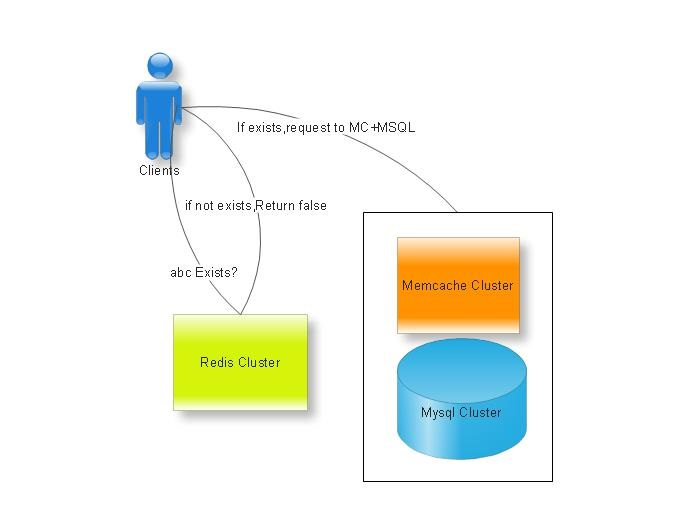
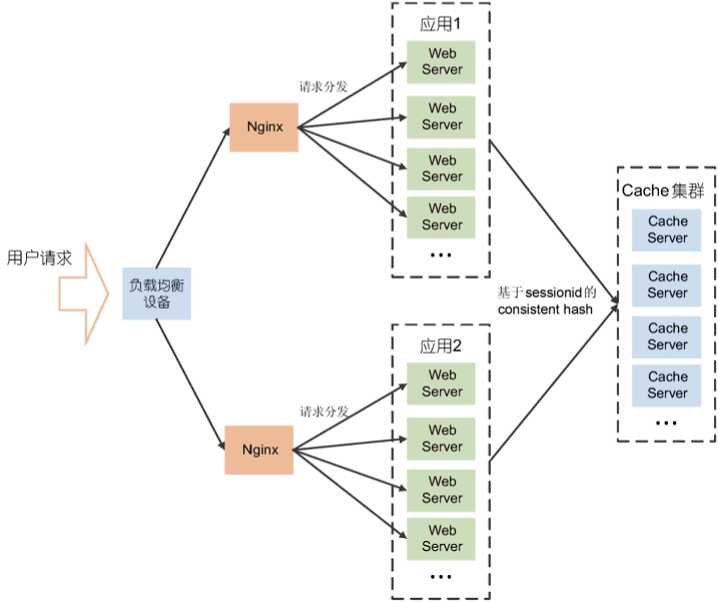
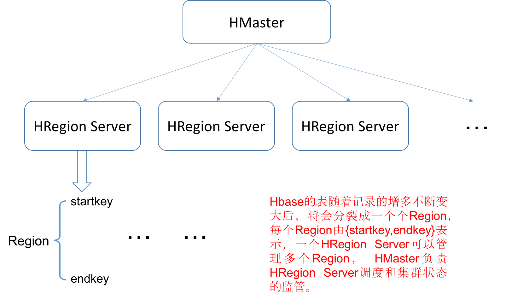

# Redis

高性能key-value数据库，不仅支持简单的key-value存储，还支持其他一系列的数据存储结构如strings、hashs、lists、sets、sorted sets等，并在这些数据结构类型上定义了一套强大的API。

- 更丰富的数据类型，较于传统关系型数据库的更好的读写吞吐能力，更高的并发数。
- 可以很轻易的完成其他key-value很难完成的任务如排序、去重、取topN、访问计数器、队列系统等。
- 将服务器设置为cache-only可以提供该性能的缓存服务。

## Jedis:redis的java客户端实现

``` java
Jedis redis = new Jedis("127.0.0.1", 6379);

// 支持strings
redis.set("name", "y"); // 设置一条记录name-ychen
redis.setex("age", 100 * 365 * 12 * 31 * 24 * 60 * 60, "100"); // 设置age-100的有效时间为100年
redis.mset("merried", "no", "career", "student"); // 设置多个[key]-[value]
redis.append("name", "chen"); //向name中追加chen
String name = redis.get("name"); //获取name的值
List<String> list = redis.mget("merried", "career"); // 获取多个key的value

// 支持hashs
// key-field-value
redis.hset("person-ychen", "name", "ychen");
redis.hset("person-ychen", "age", "100");
redis.hset("person-ychen", "career", "student");

Map<String, String> personMap = new HashMap<String, String>();
personMap.put("name", "li");
personMap.put("age", "100");
personMap.put("career", "student");
redis.hmset("personal-li", personMap);

List<String> hlist = redis.hmget("person-li", "name", "age", "career");

Map<String, String> liMap = redis.hgetAll("person-li");

// 支持lists
redis.lpush("persons", "left No.1");
redis.lpush("persons", "left No.2");
redis.rpush("persons", "right No.1");
redis.rpush("persons", "right No.2");
redis.lpop("persons");

List<String> personList = redis.lrange("persons", 1, 3);
Long personListSize = redis.llen("persons");

// 支持sets
redis.sadd("person-set", "chen");
redis.sadd("person-set", "li");
redis.sadd("person-set", "qing");
redis.sadd("person-set", "min");
redis.sadd("person-set", "min");
redis.srem("person-set", "qing");
Set<String> set = redis.smembers("person-set");

// 支持sorted sets
redis.zadd("person-sorted-set", 1, "5th");
redis.zadd("person-sorted-set", 2, "4th");
redis.zadd("person-sorted-set", 3, "3th");
redis.zadd("person-sorted-set", 4, "2th");
redis.zadd("person-sorted-set", 5, "1th");

Set<String> sortset = redis.zrange("person-sorted-set", 2, 4);

System.out.println(sortset.toString());
```

## Redis的hashs

  

首先Redis内部使用一个redisObject对象来表示所有的key和value,redisObject最主要的信息如上图所示：type代表一个value对象具体是何种数据类型，encoding是不同数据类型在redis内部的存储方式，比如：type=string代表value存储的是一个普通字符串，那么对应的encoding可以是raw或者是int,如果是int则代表实际redis内部是按数值型类存储和表示这个字符串的，当然前提是这个字符串本身可以用数值表示，比如:"123" "456"这样的字符串。

这里需要特殊说明一下vm字段，只有打开了Redis的虚拟内存功能，此字段才会真正的分配内存，该功能默认是关闭状态的，该功能会在后面具体描述。通过上图我们可以发现Redis使用redisObject来表示所有的key/value数据是比较浪费内存的，当然这些内存管理成本的付出主要也是为了给Redis不同数据类型提供一个统一的管理接口，实际作者也提供了多种方法帮助我们尽量节省内存使用，我们随后会具体讨论。

Redis Hash对应Value内部实际就是一个HashMap，实际这里会有2种不同实现，这个Hash的成员比较少时Redis为了节省内存会采用类似一维数组的方式来紧凑存储（zipmap），而不会采用真正的HashMap结构，对应的value redisObject的encoding为zipmap,当成员数量增大时会自动转成真正的HashMap,此时encoding为ht。

## 应用场景

### Reverse cache（反向cache）

面对微博常常出现的热点，如最近出现了较为火爆的短链，短时间有数以万计的人点击、跳转，而这里会常常涌现一些需求，比如我们向快速在跳转时判定用户等级，是否有一些账号绑定，性别爱好什么的，已给其展示不同的内容或者信息。

普通采用memcache+Mysql的解决方案，当调用id合法的情况下，可支撑较大的吞吐。但当调用id不可控，有较多垃圾用户调用时，由于memcache未有命中，会大量的穿透至Mysql服务器，瞬间造成连接数疯长，整体吞吐量降低，响应时间变慢。

这里我们可以用redis记录全量的用户判定信息，如string key:uid int:type，做一次反向的cache，当用户在redis快速获取自己等级等信息后，再去Mc+Mysql层去获取全量信息。如图：  

  

当然这也不是最优化的场景，如用Redis做bloomfilter，可能更加省用内存。

## 注意

### Small item & Small instance!

由于Redis单线程（严格意义上不是单线程，但认为对request的处理是单线程的）的模型，大的数据结构list,sorted set,hash set的批量处理就意味着其他请求的等待，故使用Redis的复杂数据结构一定要控制其单key-struct的大小。

另外，Redis单实例的内存容量也应该有严格的限制。单实例内存容量较大后，直接带来的问题就是故障恢复或者Rebuild从库的时候时间较长，而更糟糕的是，Redis rewrite aof和save rdb时，将会带来非常大且长的系统压力，并占用额外内存，很可能导致系统内存不足等严重影响性能的线上故障。我们线上96G/128G内存服务器不建议单实例容量大于20/30G。

# Memcache

## 问题和缺点

- memcached单个item的数据最大是1MB，大于1MB可以压缩或拆分到多个key中。
- 数据全部在内存中，服务器一重启数据全部丢失。
- 只能做缓存不能持久化，不是为了处理庞大的数据而设计的。
- 安全问题，没有提供任何安全策略。

## 优点

- get和set的性能比redis要好不少。
- 可以存储session。
- LRU算法+超时失效的cache机制。
- memcached 1.2.5以及更高版本，提供了gets和cas命令，可以防止并发修改带来的问题。

Memcache是这个项目的名称，而memcached是它服务器端的主程序文件名。

Memcache是一个高性能的分布式的内存对象缓存系统，通过在内存里维护一个统一的**巨大的hash表**，它能够用来存储各种格式的数据，包括图像、视频、文件以及数据库检索的结果等。简单的说就是将数据调用到内存中，然后从内存中读取，从而大大提高读取速度。

使用LRU算法淘汰最近不常访问的数据。使用libevent来进行高效的网络连接处理。

本身并不是一种分布式的缓存系统，分布式是由访问它的客户端来实现的。最常用[一致性哈希](ConsistentHashing.md)来处理数据存储的问题。

支持对缓存数据进行CAS操作。可以防止并发修改带来的问题。

使用Memcached-Java-Client工具。

``` java
MemcachedItem item = memCachedClient.gets("key");
memCachedClient.cas("key", (Integer)item.getValue() + 1, item.getCasUnique());
```

# 基于缓存的分布式session



## HBase
- 分布式数据库，列存储数据库。
- 数据按照rowkey排序。
- 要想访问HBase的行，只能：通过指定rowkey访问，指定rowkey的range进行scan，全表扫描。
- HBase的关键：rowkey的设计。
- 适合海量数据存储，能同时多个节点写入，但难以支持复杂查询如group by, order by, join。



# Reference

1. [国内外三个不同领域巨头分享的Redis实战经验及使用场景](http://www.csdn.net/article/1970-01-01/2817107)