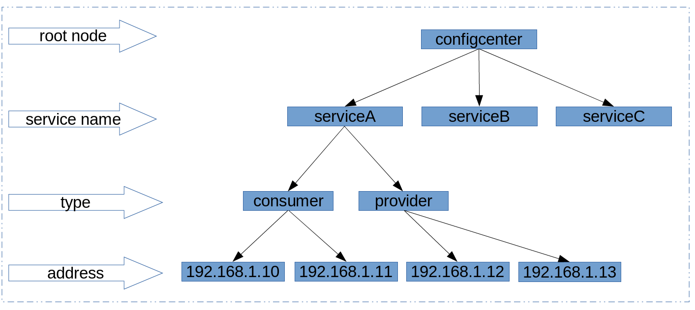

#ZooKeeper#
- 持久和非持久节点，使得几乎可以实时感知到后端服务器状态。
- 可以集群复制，Zookeeper Atomic Broadcast协议，使得服务配置信息保持一致。
- 容错特性和leader选举，使得可以很方便的扩容。

##Zab协议##
1. leader election
2. Atomic Broadcast

集群选举出一个leader，其他成为follower，所有写操作都传送给leader，并通过broadcast将所有更新告诉follower。

ZooKeeper实现了一个层次命名空间的数据模型，看起来像是一个小型的，精密的文件系统。把集群中的一个节点表示成znode，znode有4种节点类型，4种节点状态变化。

```java
String url = "127.0.0.1";
ZooKeeper zooKeeper = new ZooKeeper(url, 600, null);//    最后一个参数watcher为null，表示不注册watcher  
zooKeeper.create("/Users/racing", "racing data".getBytes(), Ids.OPEN_ACL_UNSAFE,
    CreateMode.PERSISTENT);

zooKeeper.delete("/Users/racing", -1);

zooKeeper.setData("/Users/racing", "new racing data".getBytes(), -1);

Stat stat = new Stat();
byte[] data = zooKeeper.getData("/Users/racing", false, stat);

zooKeeper.create("/Users/racing/Downloads", "racing data".getBytes(), Ids.OPEN_ACL_UNSAFE,
    CreateMode.PERSISTENT);

Stat state = zooKeeper.exists("/Users/racing/Documents", false);
if (state == null) {
    System.out.println("节点不存在");
}
```

```java
private class ZKWatcher implements Watcher {

    @Override
    public void process(WatchedEvent event) {
        if (event.getType() == EventType.NodeDeleted) {
            System.out.println("节点已删除，可以做一些删除后处理工作！");
        }
        if (event.getType() == EventType.NodeCreated) {
            System.out.println("节点创建！");
        }
        if (event.getType() == EventType.NodeDataChanged) {
            System.out.println("节点数据变更！");
        }
        if (event.getType() == EventType.NodeChildrenChanged) {
            System.out.println("节点的子节点有变化！");
        }
    }
}
```

每次watcher处理之后，该注册的watcher失效，需要重新注册该节点的watcher。

使用ZooKeeper第三方工具包zkclient.jar可以解决重新注册的麻烦。zkclient在一个watcher生效的时候，会自动重新注册一个相同的watcher。其把ZooKeeper的四种节点状态的变化类型封装成了三种：子节点的变化，节点连接和状态变化，节点数据变化。在ZooKeeper中注册watcher是实现Watcher接口，在zkclient中是向zookeeper的一个节点注册IZkStateListener、IZkChildListener、IZkDataListener的实现。

zkclient还提供了ZkSerializer接口，简化了znode的数据存储。

```java
ZkClient zkClient = new ZkClient("127.0.0.1");
zkClient.create("/root", "root date", CreateMode.PERSISTENT);

List<String> children = zkClient.getChildren("/root");

int count = zkClient.countChildren("/root");
```

zkclient注册watcher。生效之后会自动注册相同的watcher。

```java
zkClient.subscribeChildChanges("/root", new IZkChildListener() {

    @Override
    public void handleChildChange(String parentPath, List<String> currentChildren)
                                                                                  throws Exception {
        System.out.println(currentChildren.toString());
    }
});

zkClient.subscribeDataChanges("/root", new IZkDataListener() {

    @Override
    public void handleDataDeleted(String dataPath) throws Exception {
        System.out.println("date deleted: " + dataPath);
    }

    @Override
    public void handleDataChange(String dataPath, Object data) throws Exception {

    }
});
    
zkClient.subscribeStateChanges(new IZkStateListener() {
    
    @Override
    public void handleStateChanged(KeeperState arg0) throws Exception {
    }
    
    @Override
    public void handleNewSession() throws Exception {
    }
});
```

当发生session expire异常的时候，进行重连，原来所有的session和EPHEMERAL都失效，可以在handleNewSession进行容错处理。

