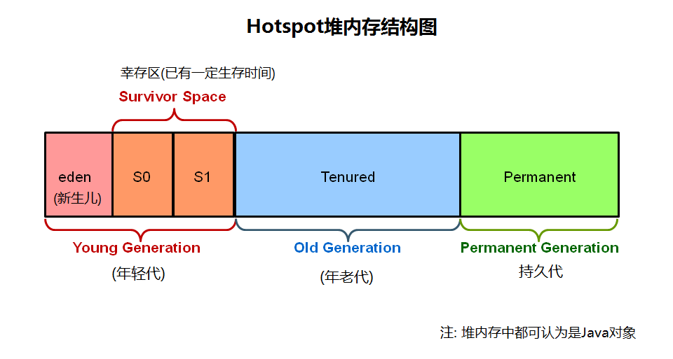

#G1 GC#
G1 (Garbage-First)是一款面向服务器的垃圾收集器,主要针对**配备多颗处理器及大容量内存**的机器. 以极高概率满足GC停顿时间要求的同时，还具备高吞吐量性能特征. 在Oracle JDK 7 update 4 及以上版本中得到完全支持, 专为以下应用程序设计:

- 可以像CMS收集器一样,GC操作与应用的线程一起并发执行
- 紧凑的空闲内存区间且没有很长的GC停顿时间.
- 需要可预测的GC暂停耗时.
- 不想牺牲太多吞吐量性能.
- 启动后不需要请求更大的Java堆.

G1的长期目标是取代CMS(Concurrent Mark-Sweep Collector，并发标记-清除)。因为特性的不同使G1成为比CMS更好的解决方案。 一个区别是，G1是一款压缩型的收集器。G1通过有效的压缩完全避免了对细微空闲内存空间的分配，不用依赖于regions，这不仅大大简化了收集器，而且还消除了潜在的内存碎片问题。除压缩以外，G1的垃圾收集停顿也比CMS容易估计，也允许用户自定义所希望的停顿参数(pause targets)。

##G1 操作概述##
上一代的垃圾收集器(串行serial，并行parallel，以及CMS)都把堆内存划分为固定大小的三个部分：年轻代(young generation)，年老代(old generation)，以及持久代(permanent generation)。  
  

内存中的每个对象都存放在这三个区域中的一个。  
而 G1 收集器采用一种不同的方式来管理堆内存。  

堆内存被划分为多个大小相等的heap region，每个heap region都是**逻辑**上连续的一段内存(virtual memory)。 其中一部分区域被当成老一代收集器相同的角色(eden，survivor，old)，但每个角色的区域个数都不是固定的。这在内存使用上提供了更多的灵活性。

G1执行垃圾回收的处理方式与CMS相似。G1在全局标记阶段(global marking phase)并发执行，以确定堆内存中哪些对象是存活的。标记阶段完成后，G1就可以知道哪些heap区的empty空间最大。它会首先回收这些区，通常会得到大量的自由空间。这也是为什么这种垃圾收集方法叫做Garbage-First(垃圾优先)的原因。顾名思义，G1将精力集中放在可能布满可收回对象的区域，可回收对象(reclaimable objects)也就是所谓的垃圾。G1使用**暂停预测模型(pause prediction model)**来达到用户定义的目标暂停时间，并根据目标暂停时间来选择此次进行垃圾回收的heap区域数量。

被G1标记为适合回收的heap区将使用转移(evacuation)的方式进行垃圾回收。**G1将一个或多个heap区域中的对象拷贝到其他的单个区域中，并在此过程中压缩和释放内存。在多核CPU上转移是并行执行的(parallel on multi-processors)，这样能减少停顿时间并增加吞吐量。因此,每次垃圾收集时，G1都会持续不断地减少碎片，并且在用户给定的暂停时间内执行**，这比以前的方法强大了很多。CMS垃圾收集器(Concurrent Mark Sweep,并发标记清理)不进行压缩，Parallel Old垃圾收集只对整个堆执行压缩，从而导致相当长的暂停时间。

需要强调的是，G1并不是一款实时垃圾收集器(real-time collector)。能以极高的概率在设定的目标暂停时间内完成，但不保证绝对在这个时间内完成。基于以前收集的各种监控数据，G1会**根据用户指定的目标时间来预估能回收多少个heap区（根据每个区域里面垃圾堆积的价值大小，即回收所获得的空间大小以及回收所需时间的经验值）**。因此，收集器有一个相当精确的heap区耗时计算模型，并根据该模型来确定在给定时间内去回收哪些heap区。

注意 G1分为两个阶段: 并发阶段(concurrent, 与应用线程一起运行, 如: 细化 refinement、标记 marking、清理 cleanup) 和 并行阶段(parallel, 多线程执行, 如: 停止所有JVM线程, stop the world). 而 FullGC(完整垃圾收集)仍然是单线程的, 但如果进行适当的调优,则应用程序应该能够避免 full GC。

##G1 的内存占用(Footprint)##
如果从Parallel Old GC或者CMS收集器迁移到G1，您可能会看到JVM进程占用更多的内存(a larger JVM process size)。这在很大程度上与：“accounting” 数据结构有关，如Remembered Sets和Collection Sets.

Remembered Sets简称RSets，跟踪指向某个heap区内的对象引用。堆内存中的每个区都有一个RSet。RSet使heap区能并行**独立地进行垃圾收集**。RSets的总体影响小于5%。

Collection Sets简称CSets，收集集合，**在一次GC中将执行垃圾回收的heap区**。GC时在CSet中的所有存活数据(live data)都会被转移(复制/移动)，集合中的heap区可以是Eden，survivor，和/或old generation。CSets所占用的JVM内存小于1%。

##推荐使用G1的场景(Recommended Use Cases)##
G1的首要目标是为需要大量内存的系统提供一个保证GC低延迟的解决方案。也就是说堆内存在6GB及以上，稳定和可预测的暂停时间小于0.5秒。

如果应用程序具有如下的一个或多个特征，那么将垃圾收集器从CMS或Parallel Old GC切换到G1将会大大提升性能。

- Full GC次数太频繁或者消耗时间太长。
- 对象分配的频率或代数提升(promotion)显著变化。
- 受够了太长的垃圾回收或内存整理时间(超过0.5~1秒)。

**注意**: 如果正在使用CMS或Parallel Old GC，而应用程序的垃圾收集停顿时间并不长，那么继续使用现在的垃圾收集器是个好主意。使用最新的JDK时并不要求切换到G1收集器。

##分配担保##

##CMS的问题##
- CPU资源敏感
- 无法处理浮动垃圾（筛选回收阶段产生的垃圾）
- 会产生内存碎片

###对于内存碎片：###
CMS提供了一个 **-XX:+UseCMSCompactAtFullCollection**开关参数[默认开启]，用于在CMS收集器顶不住要进行Full GC时开启内存碎片的合并整理过程。

合并整理的过程是无法并发的，空间碎片问题没有了，但是停顿时间不得不变长。虚拟机设计者还提供了另外一个参数 **-XX:CMSFullGCsBeforeCompaction**，这个参数是用于设置执行多少次不压缩的Full GC后，跟着来一次带压缩的（默认值为0，标识每次进入Full GC时都进行碎片整理）。

##方法调用字节码指令##
- invokestatic：调用静态方法
- invokespecial：调用实例构造器<init>方法、私有方法和负累方法
- invokevirtual：调用所有的虚方法（可以被覆盖的方法，final修饰除外）
- invokeinterface：调用接口方法，会在运行时再确定一个实现此接口的对象
- invokedynamic：先在运行时动态解析出调用点限定符所引用的方法，然后再执行该方法。

解析阶段是虚拟机将常量池内的符号引用替换为直接引用的过程。除了invokedynamic，虚拟机实现可以对其他方法调用字节码指令的第一次解析结果进行缓存。invokedynamic要等到程序实际运行到这条指令的时候，解析动作才能进行。

虚方法的调用字节码指令都为invokevirtual，但是final修饰的方法因为不能被覆盖，所以不叫虚方法，但是还是用invokevirtual。就这个特例。
