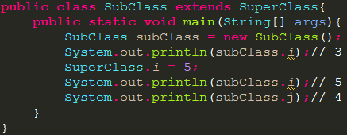
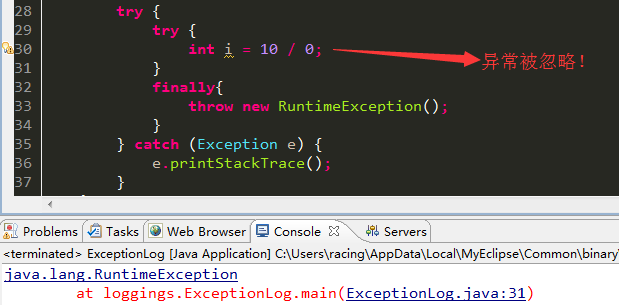
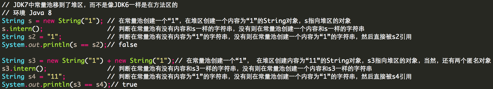
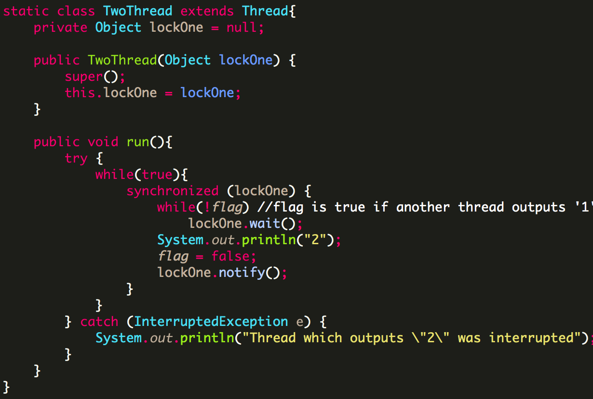

##大端小端##
（Java采用的Big Endian字节序，所有的网络协议也都是采用Big Endian字节序来进行传输的）计算机中的数据存放是从内存的低位地址开始的，比如，从地址为0的地方开始存放数据，接着从地址为1的地方开始存放数据，...，则大端模式和小端模式为，

- 大端模式：数据的**高**位存放在**低**位地址的内存中（即高位先存）。
- 小端模式：数据的**低**位存放在**低**位地址的内存中（即低位先存）。

数据ox1234的存放情况为，  
  
只要记住：大端是数据高位和地址高位相反（不一致），小端则一致。

  
另一边是空的，当然不浪费一个对象来引用之。

##初始化与清理（机制和流程）##
- 构建和初始化是捆绑在一起的，对于方法重载的两个（或以上）方法，参数的类型、个数、**顺序**总有一项是不同的，不能通过返回值来区分重载方法，这是因为有时候你调用一个方法并不关心它的返回值而是关心它的执行过程。**除了构造器之外，编译器禁止其他任何方法中调用构造器**。
- finalize()存在的意义？finalize()应该怎么用？用在哪里？
- 理解垃圾回收器的工作方式：引用计数的方法（每个对象都有一个引用计数器，当有引用连接至对象时，该引用计数器加1，引用离开作用域或被置null时，引用计数器减1，引用计数为0时对象被清理）。引用计数方法只适合用来理解垃圾回收器的工作方式，但是还没有被应用在任何一种JVM中，存在循环引用的问题。
- 初始化顺序：假设有个名为Dog的类:
    1. 【加载】当首次创建Dog的对象或者Dog类的静态方法/静态域（非编译期常量）被首次访问时，java解释器必须查找类的路径，找到Dog.class文件，然后载入Dog.class（这会创建一个Class对象，然后对这个Class对象进行初始化。每个类都有一个Class对象，类的对象由这个Class对象创建）。（由此得知什么时候会载入一个类的字节码，从下面步骤也得知，载入字节码之后会发生什么事）。
    2. 【链接】验证类中的字节码，为静态区域分配存储空间。接下来，【初始化，对一个类进行初始化，也叫对一个Class对象进行初始化】。有关**静态初始化**的所有动作都会执行。（静态块和静态域按顺序执行，也就是说，静态初始化发生在new操作在堆上为对象分配存储空间之前）。
    3. 当用new Dog()创建对象时，首先将在堆上为对象分配足够的存储空间。再次注意，非静态块初始化发生在new操作之后！！！（因为静态块静态区域的内容是在常量池的，所以初始化比较早。非静态块的内容是在对象的空间上的，属于堆的，所以，需要先new分配空间后，才能进行初始化）。
    4. 这块存储空间清零（二进制的0），即自动的把对象的所有基本数据类型设置成了默认值。
    5. 执行所有出现在字段定义处的初始化动作。
    6. 执行构造器。
        - 子类无论什么构造器，内部都会自动调用父类的默认构造器（即无参构造器），如果父类没有无参构造器，则子类构造器出错，**需要强制调用父类的构造器**，调用父类的有参无参构造器均可。 
        - 子类构造器执行，必须先执行父类的构造器，子类想要初始化，必须先初始化父类。

所以总的构造顺序是：<font color="red">父类静态块 --> 然后是子类静态块 --> 父类自由块 --> 父类构造函数块 --> 子类自由块 --> 子类构造函数块</font>，很容易忽略但是是事实的点：父类构造器在子类成员初始化前！！！！！

###static###
父类中的static域只会存在一份拷贝，并且不会在子类中有一份拷贝存在，子类中调用这个属性值访问的也是父类那个域的值。如，（**static方法不具有多态性，存在父类的常量池中**）：  
  


##内部类（用途和麻烦）：##
###获取当前内部类对象所链接的外围类对象的引用###
在内部类中的方法内部，调用外围类类名.this方法会返回当前内部类所连接的外围类对象的引用，（内部类如果使用了外部环境的状态，那么，内部类加上创建它的外部环境，就叫做闭包）如：

```java
public class EnclosingClass {

    private int i = 0;

    class InnerClass {
        public EnclosingClass getEnclosingClass() {
            EnclosingClass.this.i = 2;
            return EnclosingClass.this;
        }
    }

}
```

###什么时候会用到内部类？###
隐藏某些实现、多继承、单元测试、闭包问题（即如果一个类继承了某个父类，这个类还想实现一个接口，但是父类和这接口有些方法或属性有冲突，想把父类和接口的功能都保留下来，那么，就可以用内部类来配合，用接口加内部类来实现闭包）

###继承内部类###
继承自内部类时有点麻烦（语法很怪！！！），使用默认的构造器会报错，因为内部类会默认的获得指向其外部类对象的引用，所以继承内部类时应该在构造器参数中传递一个其外部类对象的引用（编译器促使你一定要这样），然后在构造器中使用该外部类对象引用的super方法（该super方法调用的是这个外部类对象的内部类的构造方法）。如果父类和接口都有一个方法，他们的方法签名相同，那么子类中的这个方法，既是父类方法的重写又是接口方法的实现。如，

 


内部类的构造器和其他方法都会默认传递一个外围类对象做参数，如：


去掉这个内部类的无参构造器时，则用反射获取不到其构造器（即，不显示的定义内部类构造器，使用反射就获取不到内部类的构造器【有参无参均获取不到】），显示的定义一个无参构造器，则可以获取到使用了外部类对象当做其默认参数的内部类构造器。

##异常##
异常的问题？异常在有的情况下会被忽略！如（直接在finally中抛出新异常或者在finally中使用return）：  



而且，子类抛出的异常会有限制，子类可以：

1. 不抛出异常；
2. 抛出父类异常说明中的异常或这些异常的子类；
3. 抛出未受检验的异常（unchecked exception）。

子类直接抛出的异常（方法名后面的那些throws）不能比父类更宽泛，但是可以在catch中抛出更宽泛的异常。

##正则表达式##
Pattern类和Matcher类的使用方法：

- 一般使用：

1. 首先，调用Pattern的静态方法compile(regex)把正则表达式编译成Pattern对象。另一个静态方法compile(regex, flag)则接受一个标记：COMMENTS(?x)忽略正则表达式中的空格和#后面的注释；CASE_INSENSITIVE(?i)忽略大小写；MULTILINE(?m)使得^和$匹配每行的开头和结尾，而不是整个输入串的开头和结尾；DOTALL(?s)使得.能匹配所有字符包括行终结符。
2. 其次，在该编译好的pattern对象上调用matcher(string)方法，生成一个Marcher对象。
3. 然后，字符串和正则表达式都已准备好，就可以在matcher上面调用各种方法进行操作了。

- 方法熟悉：

1. Pattern的静态方法matches(regex, string)，判断正则表达式是否能匹配字符串，返回boolean。相当于matcher对象的无参方法matches()。
2. Matcher对象的方法：无参方法<font color="red">lookingAt()</font>，匹配字符串的起始部分，如果返回true，则可以接着调用group方法获得匹配了的字符串部分；无参<font color="red">find()</font>，寻找字符串的下一个匹配，返回true之后，可以调用group、start（包含）和end（不包含）方法操作；有参<font color="red">find(index)</font>，相当于从第index位置起的无参find()；无参<font color="red">group()</font>，在find()操作之后，因为要先用find找到匹配，才能返回匹配的部分，group返回匹配了的string，和start()、end()可以一起用，来获得匹配部分的详细信息。无参<font color="red">reset()</font>，在find()迭代完成之后，调用reset重置，可以重新迭代。有参<font color="red">reset(string)</font>，则表示把matcher作用于新的string，即参数；<font color="red">appendReplacement(StringBuffer, replacement)</font>【把matcher上匹配到的结果替换为replacement，replacement中可以使用组号获取正则表达式中的组，然后再把替换后的结果挂载到StringBuffer中】，允许在替换的时候做一些特殊处理，一步一步进行替换，把上一次匹配和这次匹配之间的结果（包括这次匹配替换）挂在到stringbuffer上去，<font color="red">appendTail(stringbuffer)</font>把最后一次匹配之后剩余的字符串挂载到stringbuffer上。如，  


###[]和()的区别###
[]表示字符类，一般表示匹配[]里面的一个字符，比如[^abc]，表示除abc外的其他一个任意字符。注：^放在中括号中才表示“非”的意思。()表示捕获组，比如，想要问号作用与前面的所有范围，则用(abc)?而不是abc?。

###量词匹配的贪婪型、勉强型和占有型###
贪婪型属于正常的表示（平时写的那些），勉强型则在后面加个问号，占有型加个加号，都只作用于前面的问号、星号、加号、大括号，因为前面如果没有这些，就变成普通的问号和加号了（也就是变成贪婪型了）。

- 贪婪型的匹配原理，一个一个匹配，先一直匹配到最后，发现最后的字符不匹配时，往前退一格再匹配，不匹配时再退一格，递归；
- 勉强型是匹配到一个字符后看看匹配能否结束，能结束就结束；
- 占有型（完全匹配）是从第一个匹配开始，把后面所有字符串读入来匹配，一直匹配到最后，如果最后的字符不匹配的话，那么也不回退，返回false结束。如，  


第三个例子的量词是占有型，所以在寻找匹配时失败。在这种情况下，整个输入的字符串被.*+消耗了，什么都没有剩下来满足表达式末尾的“foo”。

第一次学习正则和string的时候做了笔记要多用scanner，因为scanner可以和正则表达式配合着分词（设定一个delimiter，默认是空格分词）、取得匹配的string（取数据时传入regex，默认取得空格分开的string）、解析数据（各种nextInt、nextFloat方法）。如：  


##RTTI和反射##
一直的疑惑，能不能自动找出一个类的所有子类？这个是无法实现的。最好的方法就是维护一个数组或list，每创建一个类就把这个类的信息（Class对象或者类名或该类的对象）放进去，然后扫描这个数组或list就可以得到所有子类实现了。最好的实现就是使用工厂方法模式，每个类不用构造器去创建对象而是使用静态的工厂方法：首先创建一个工厂接口（可以维护一个static的list），包含一个静态的工厂方法，然后创建工厂实现该接口。每创建一个类（对应一个工厂类）的同时，往接口的list手动添加该类的信息，则可以扫描到所有子类。

**Thinking in java中的一个错误（是作者犯得错误还是编译器版本不同造成的）？**利用反射，可以修改final域的基本类型的值，在eclipse中不能修改final域的String对象，【但是用文本编辑器，使用javac编译，则可以修改final域的对象（String也可以）】。但是在两种情况下，都不能修改static final域。如，

1. final域类（没有static修饰符，如果有static修饰符，试图修改static final域的值，则会在运行时抛出IllegalAccessException异常）  

2. 利用反射获取和修改final域（用sublime编辑，javac编译的情况）  

3. 输出  


###结论：###
只要知道方法名，只要知道变量名，利用反射就可以随意获取一个类的信息，调用一个类的方法(method.invoke(obj))，无论访问权限修饰符是什么！（Method和Field都有setAccessible(boolean)方法，可以把访问权限设置为public【但是获取修饰符时，private修改访问权限之后不会显示为public】）【class.getMethods()会获取继承而来的所有方法，class.getDeclaredMethods()获取类中声明的方法】  


动态代理是动态地创建代理并动态地处理对所代理方法的调用。实现动态代理需要实现InvocationHandler接口，实现其invoke(object, method, args[])函数，传递的是一个代理实例（通常不管（Proxy类库的$Proxy0），参见[http://paddy-w.iteye.com/blog/841798](http://paddy-w.iteye.com/blog/841798)），方法，和参数。动态代理对象是用静态方法Proxy.newProxyInstance()方法创建的，第一个参数是希望代理的接口的类加载器，第二个参数是希望该代理实现的接口列表（Class对象数组），第三个参数是InvocationHandler接口的一个实现。动态代理代理的方法都会经过第三个参数的对象所实现的invoke方法来进行代理调用，因此通常会向调用处理器传递一个“实际对象”的引用（如下面的readObject对象），从而使得调用处理器可以将请求转发。  
  
其中，  
代理类实例proxy的类名是：$Proxy0  
proxy中的属性有：m1, m0, m3, m4, m2,  
proxy中的方法有：equals, toString, hashCode, doSomething, somethingElse,  
proxy的父类是：class java.lang.reflect.Proxy,  
proxy实现的接口是：opensource.Test$Interface.

###动态代理的作用：###
主要用来做方法的增强，让你可以在不修改源码的情况下，增强一些方法，在方法执行前后做任何你想做的事情（甚至根本不去执行这个方法），因为在InvocationHandler的invoke方法中，你可以直接获取正在调用方法对应的Method对象，具体应用的话，比如可以**添加调用日志，做事务控制**等。还有一个有趣的作用是可以用作远程调用，比如现在有Java接口，这个接口的实现部署在其它服务器上，在编写客户端代码的时候，没办法直接调用接口方法，因为接口是不能直接生成对象的，这个时候就可以考虑代理模式（动态代理）了，通过Proxy.newProxyInstance代理一个该接口对应的InvocationHandler对象，然后在InvocationHandler的invoke方法内封装通讯细节就可以了。具体的应用，最经典的当然是Java标准库的RMI，其它比如hessian，各种webservice框架中的远程调用，大致都是这么实现的。

##泛型##
容器类泛型尖括号表示的是想持有什么样的类型，比如List\<String\> list = new ArrayList\<String\>();list指向的还是ArrayList的类型，只是要往其中add或get的时候是String类型的，但是Class\<Integer\> cc = Integer.class;cc = Double.class;后面这句会出错。  

以前一直理解为这里的cc指向的是Integer类型的，其实也是跟前面的list一样，这里的cc指向的是Class对象，只不过这个Class对象里面保存的是Integer的信息！

编译器会干什么，编译器不能干什么？编译器会尽力保证你放进泛型对象中的类型是正确的。编译器会检查你传进去的数据是不是正确的类型（此时不会插入任何代码，只是编译器检查），在字节码文件中，可以看到：在取出泛型对象中的数据时，编译器自动插入了一条转型代码。所以，综合来说，编译器是尽可能保证你的类型使用是安全的，但是又不能完全保证（因为运行时的类型安全是编译器保证不了的）。

###为什么不能创建泛型数组？能创建泛型对象吗？###
在泛型代码中，不能用T t = new T()形式创建对象，不能用T[] tt = new T[n]创建泛型数组，不能使用instanceof检查泛型类型。那么，

1. ***如何在泛型代码中创建对象和创建数组？***  
   解：传入类型标签，使用RTTI来创建对象和识别对象类型，创建对象和数组
2. ***创建泛型类型的数组？***  
   解：创建泛型类型的引用，指向非泛型类型的数组，然后再转型为泛型类型的数组。

  


以前理解有误，认为泛型中通配符是代表所有的类型，随意什么类型，现在需要改正一下：通配符代表的是某种确切的类型，它可以是任意的类型，但是它是确切的、确定了的。如，  
  

平时使用泛型可能会出现一个问题，因为可以向Java SE5之前的代码传递泛型容器，所以旧式代码仍旧有可能破坏容器，比如：  
  
用注释掉的那行来解决问题，即Collections的静态方法checkedList(), or checkedCollection(), checkedMap(), checkedSet(), checkedSortedMap(), checkedSortedSet(),etc. 接受想要强制类型检查的容器为第一个参数，要强制检查的类型为第二个参数。

自限定的类型的用处就是使用了自限定，就只能获得某类中泛型参数的一个版本，它将接受确切的参数类型。自限定限制只能强制作用于继承关系，如果使用自限定，就应该知道这个类所用的类型参数将与使用这个参数的类具有相同的基类型。class SuperClass\<T extends SuperClass\<T\>\>这样的基类型，在使用时只能class SubClass extends SuperClass\<SubClass\>这样，如，  
  

##数组##
以前没有注意的，数组工具类Arrays提供了很多功能的。容器类有工具类Collections，数组有Arrays。一个复制数组很好的方法是System.arraycopy()，比自己复制要快很多，基本类型数组和对象数组都可以复制，但是复制对象数组时是浅复制（shallow copy）; Arrays.equals()比较两个数组是否相等，基本类型数组的比较会自动采用包装器类型的equals方法；Arrays.sort()对数组排序，可以传入实现了Comparator接口的比较器或者数组元素自身实现Comparable接口；Arrays.binarySearch()对已经排好序的数组查找元素，若未找到，返回值是“-(应该插入的位置)-1”，如果自定义了比较器，binarySearch需要提供比较器。

##容器类的困惑##
###TreeSet中的元素保持唯一性依赖的仅仅是equals方法和hashCode方法吗？下面这个怎么解释？###
【TreeSet是基于TreeMap实现的，TreeMap的put中只使用了compareTo方法，没有用equals方法，甚至都没用hash()】  
解决：仅仅是依赖于compareTo方法，跟equals没有关系，查找的时候是从树的root进行查找，小了就往左查，大了就往右查。  
  

HashMap中，如果对keySet进行修改操作，会影响到HashMap的结果，比如，map.keySet().remove(o)，这样map中会移除o这个对象对应的那个Entry，如（HashSet就是使用HashMap来实现的），  
  

LinkedHashMap可以按照访问顺序存放entry（注意不是访问次数！），把最近访问过的元素往后放（不是总访问次数越多就越在后面），LinkedHashSet没有这功能，只有保持插入顺序。LinkedHashMap的accessOrder使用如下，  

```java
        LinkedHashMap<String, String> lhm = new LinkedHashMap<String, String>(16, 0.75f, true);
        lhm.put("2", "2");
        lhm.put("1", "1");

        lhm.get("1");
        lhm.get("1");
        lhm.get("1");
        lhm.get("2"); // 最近访问过的元素放在后面

        for (Map.Entry<String, String> entry : lhm.entrySet()) {
            System.out.println(entry.getKey() + " " + entry.getValue());
        }
        
        /** output
         *  1 1
         *  2 2
         */
```

###LinkedHashSet已经是链表，那么怎么配合哈希表工作？###
（照样当哈希表用，只不过每一项维持前后指针）LinkedHashSet的实现依赖于HashSet中的一个构造方法，该构造方法创建了一个LinkedHashMap来实现LinkedHashSet的功能（说得清楚一点就是LinkedHashSet是基于LinkedHashMap实现的），LinkedHashMap中的Entry扩展（继承）了HashMap中的Entry，HashMap中的Entry有key、value、next(Entry)、hash(int)属性，而LinkedHashMap中的Entry扩展出了before、after，所以就能实现Linked的功能，又能基本保持HashSet的性能。因为有before、after（TreeMap中有left、right、parent），所以TreeSet和LinkedHashSet的迭代一般都要比HashSet快（但是也快不了很多，效果提升不是很明显）。

HashSet和HashMap的容量自动扩充和负载因子的关系：具有允许指定负载因子的构造器，表示负载情况达到该负载因子的水平时，容量将自动增加其容量（桶位数），实现方式是使容量大致加倍，并重新将现有对象分布到新的桶位集中（称为再散列）。

以前不能理解为什么会有ConcurrentHashMap、CopyOnWriteArrayList、CopyOnWriteArraySet。现在应该知道，**<font color="red">java容器类类库采用了快速报错机制（fail-fast），会探查容器上除了你的进程所进行的操作之外的所有变化，一担它发现其他进程修改了容器，就会立刻抛出ConcurrentModificationException。所以，ConcurrentHashMap、ConcurrentLinkedQueue、CopyOnWriteArrayList、CopyOnWriteArraySet是消除了ConcurrentModificationException的。比如，CopyOnWriteArrayList的写入会导致整个底层数组复制一遍，然后在复制之后的数组上修改，修改之后再替换回去，所以不会抛出ConcurrentModificationException，锁粒度也变小了，性能比Collections.synchronizedList好，但是实时性不如后者强。但是写入操作的优先级比读取操作的优先级要高，如果对实时可见性的要求和独占访问要求不是非常严格的话，推荐使用ConcurrentHashMap、CopyOnWriteArrayList、CopyOnWriteArraySet。</font>**

###HashMap怎么根据hashCode值和桶容量来确定对象在桶内的索引的？是hashCode值和length按位与操作么？然后就得到了索引值？###
解决：无论对什么对象，HashMap都有一个方法hash(Object)，计算出这个对象的hash值，是这样计算的：  
  
然后再用indexFor(hash, table.length)找到在桶中的位置，indexFor函数中就一行代码，return hash & (length - 1); 所以，是和数据结构中学的哈希表的原理是一样的，而且，这里解决冲突用的是链地址法（double hashing是什么？），找到桶之后，再在桶的链中一个一个找(**使用链地址法来解决哈希值冲突的情况，因为可能不同的key会具有相同的哈希值（因为哈希表也就那么长））**)，如，  
  

###java.lang.ref内的Reference的子类，软引用、弱引用和虚引用。什么时候有用？###
当存在可能会耗尽内存的大对象的时候特别有用！软引用是内存敏感的，在内存不足时，垃圾回收器才会回收那些只有软引用的对象，可以用来实现高速缓存。弱引用则是在垃圾回收器工作时，只要发现了弱引用（可能不会发现），不管内存怎么样，都会回收只有弱引用的对象。虚引用在任何时候都可能被垃圾回收，对象可有可无，必须和ReferenceQueue联合使用，可以被用来在对象被清理前做一些清理前的操作。

使用BitSet而不是EnumSet的理由是：只有在运行时才知道需要多少个标志；对标志命名不合理；需要BitSet中的某种特殊的操作。

##IO##
可以从FileInputStream、FileOutputStream和RandomAccessFile中得到FileChannel，唯一与FileChannel打交道的缓冲器是ByteBuffer，所以只需要关注ByteBuffer即可。

###序列化的三种方式###
1. 实现Serializable接口（该接口没有任何方法）。使用ObjectInputStream和ObjectOutputStream，直接读取和写入对象。读取对象之后要转型。<font color="red">对对象进行还原时，不会调用对象的构造器，但是会初始化父类，调用父类的默认构造器</font>。默认的序列化不会序列化static域，需要手动实现。
2. 继承Externalizable来序列化时，需要实现writeExternal(ObjectOutput)和readExternal(ObjectInput)方法来控制序列化过程。<font color="red">恢复对象时，会初始化，会先调用默认构造器，再调用readExternal()方法</font>。
3. 在实现Serializable接口的类中添加writeObject(ObjectOutputStream)和readObject(ObjectInputStream)则可以自己定制序列化过程，相当于Externalizable的替代方法。要使用默认机制写入对象的非transient部分，则需要调用defaultWriteObject()方法。

##String.intern()在JDK6和7中的区别：##


##java引进匿名内部类的原因：##
1. 完善多重继承
   - C++作为比较早期的面向对象编程语言，摸着石头过河，不幸的当了炮灰。比如多重继承，Java是不太欢迎继承的。因为继承耦合度太高。比如你是一个人，你想会飞，于是就继承了鸟这个类，然后你顺便拥有了一对翅膀和厚厚的羽毛，可这些玩意你并不需要。所以Java发明了接口，以契约的方式向你提供功能。想想看，你的程序里成员变量会比函数多吗？况且多重继承会遇到死亡菱形问题，就是两个父类有同样名字的函数，你继承谁的呢？其实C++也可以做到这些，那就是定义没有成员变量的纯虚类，而且所有函数都是纯虚函数。可是这些都是要靠程序员自己把握，并没有把这些功能集成到类似Interface这样的语法里。
   - 所以Java只支持单重继承，想扩展功能，去实现接口吧。很快Java的设计者就发现了他们犯了矫枉过正的错误，多重继承还是有一定用处的。比如每一个人都是同时继承父亲和母亲两个类，要不然你的身体里怎么能留着父母的血呢？Java内部类应运而生。
2. 实现事件驱动系统
   - 用来开发GUI的Java Swing使用了大量内部类，主要用来响应各种事件。Swing的工作就是在事件就绪的时候执行事件，至于事件具体怎么做，这由事件决定。这里面有两个问题：1.事件必须要用到继承 2.事件必须能访问到Swing。所以必须把事件写成内部类。
3. 闭包
   - 内部类是面向对象的闭包，因为它不仅包含创建内部类的作用域的信息，还自动拥有一个指向此外围类对象的引用，在此作用域内，内部类有权操作所有的成员，包括private成员。一般使用一个库或类时，是你主动调用人家的API，这个叫Call，有的时候这样不能满足需要，需要你注册（注入）你自己的程序（比如一个对象)，然后让人家在合适的时候来调用你，这叫Callback。
   - 当父类和实现的接口出现同名函数时，你又不想父类的函数被覆盖，回调可以帮你解决这个问题。
   - Java中匿名内部类要引用外部方法的变量时，要求变量一定要是final的，这是因为闭包机制。因为闭包会使得某些自由变量的生命周期变长，直到回调函数执行完毕。  
  
上面getHello()就是一个回调函数，它给别人注册了一个可以调用本身内部状态的接口，getHello()函数中就使用了闭包。java中每个方法在调用的时候，对方法中的参数、内部参数创建的都是局部变量，比如上图中temp传递进来，就会创建一个局部变量引用这个temp，在方法调用完毕之后这个局部变量就会被回收。<font color="red">闭包机制应该使得方法中的局部变量的生命周期延长</font>，因为该匿名内部类可以完全访问外部的状态（即getHello方法中的状态），这个被返回的匿名内部类实例也可能一直被外部引用着，如果没有使用final，方法中的状态应该会随着方法调用的结束而消亡，但是匿名内部类的实例还被外部引用着，而且这个匿名内部类的实例内部还使用了已经随着方法消亡的状态，这会造成错误。所以匿名内部类中引用着的getHello方法中的局部变量不应该随着方法调用结束而消亡。所以一定要使用final，<font color="red">使得在创建匿名内部类实例的时候，所引用的方法的局部变量被复制了一份</font>(***如何证明被复制了一份？***)，这份复制的变量的生命周期和匿名内部类的实例的生命周期是一样的，不会随着这个回调函数结束而终止。

#Concurrent#
##ConcurrentHashMap##
首先，关注其中的两个内部类:

1. 内部类Segment，其表示HashMap中的桶，它继承了ReentrantLock:  
  
2. 内部类HashEntry，表示其中的每一项，相当于HashMap中的内部类Entry。其有四个域：hash、key、value、next:  
  

其次，关注ConcurrentHashMap中的get方法：  
  
可以看到，读数据的时候没有加锁，而是使用了sun.misc.Unsafe的读取volatile变量的方法，所以读性能比同步的HashMap高很多。

然后，看看修改ConcurrentHashMap的方法：  
  
对每个segment加锁然后进行put。每个segment中维持了一个count和modcount，count是segment中元素的个数，modCount是当前segment被修改的总次数（有什么用？）。

再次，关注size()方法（**热点域**问题）：  
  
其中，retries++ == RETRIES_BEFORE_LOCK那一行，是因为如果每次都加锁遍历，可能性能会较低，由于在累加count操作的过程中，之前累加过的count发生变化的几率非常小，所以ConcurrentHashMap的做法是，<font color="red">先尝试2次不锁住Segment的方式来统计各个Segment的大小</font>，如果统计过程中，容器的count发生了变化（根据modCount，因为每次修改ConcurrentHashMap时，都会同步更新modCount），则采用加锁的方式来统计所有的Segment的大小。

##CopyOnWriteArrayList##
<font color="red">内部维持了一个ReentrantLock</font>，维持了一个<font color="red">volatile修饰的数组</font>，在读的时候不上锁，修改的时候（set和add的时候，先复制，再修改，再写回）：  
  
setArray()中就是一个赋值操作。把数组赋给CopyOnWriteArrayList内部的volatile数组。

##JMM和DCL被抛弃的原因##
Java内存模型为不可变对象的共享提供了一种特殊的初始化安全性保证，初始化安全性表明：

- 对于不可变对象或者final域，初始化安全性可以防止对对象的引用被重排序到构造过程之前，即使是不安全的延迟初始化和未同步的情况。

重排序能使JVM充分利用现代多核处理器的强大性能，例如，在缺少同步的情况下，Java内存模型允许编译器对操作顺序进行重排序，并将数值缓存在寄存器中。此外，它还允许CPU对操作顺序进行重排序，并将数值缓存在处理器特性的缓存中。

DCL双重检查锁定机制是为了解决并发环境下单例模式中的高昂的同步代价，但是是不安全的，是因为Java内存模型的原因，对对象的引用会被JMM机制重排序到对象完全构造完毕之前，线程可能看到一个未被完全构造的对象。  
  

上图中发布对象的方式是不安全的，因为在并发环境中，可能会有线程正在执行Singleton的构建过程，但是另一个线程却获得了这个Singleton对象的引用（此时这个Singleton对象还未构造完全），这是因为JMM机制，使得**获取该对象的引用的操作被重排序到该对象完全构造完毕之前**，从而引发错误。

JMM提供的初始化安全性可以保证final域的获取对象引用的操作不会被重排序到构造过程之前。所以上面的代码，只要在instance前加final，或者volatile修饰符，那么就可以保证安全的发布instance对象（没有保证未同步的情况下安全的访问instance，除非没有其他方法能修改instance对象）。

Reference: [单例模式的七种写法](http://cantellow.iteye.com/blog/838473)

##线程池##
一般使用ExecutorService的实例对象来执行线程，如`ExecutorService exec = Executors.newCachedThreadPool();然后调用exec.execute(new Runnable());`来运行Runnable对象。

ExecutorService扩展了Executor接口，称为线程池，也称为服务。Runnable对象称为任务。

使用线程池而不是单纯的使用Thread来实现并发是因为：

- 合理利用线程池能够带来三个好处：
  1. 降低资源消耗。通过重复利用已创建的线程降低线程创建和销毁造成的消耗。【线程池一般会限制最大线程数量，不会无止境的创建线程来消耗系统资源。已完成任务的线程会进行休眠，再在需要的时刻被分配任务执行，避免了重复创建线程的开销】。
  2. 提高响应速度。当任务到达时，任务可以不需要等到线程创建就能立即执行。
  3. 提高线程的可管理性。线程是稀缺资源，如果无限制的创建，不仅会消耗系统资源，还会降低系统的稳定性，使用线程池可以进行统一的分配，调优和监控。但是要做到合理的利用线程池，必须对其原理了如指掌。

ExecutorService是一个interface，使用Executors创建ExecutorService对象时，可以选择带参数的方法`.newCachedThreadPool(ThreadFactory threadFactory)`，其中ThreadFactory是一个interface，可以创建一个实现该接口的可定制的类，实现其方法`newThread(Runnable runnable)`即可。`.newCachedThreadPool(ThreadFactory threadFactory)`会使用ThreadFactory中的`newThread(Runnable r)`来创建线程，创建的线程拥有newThread方法中定义的所有属性，如
  
和
  
这样使用DaemonThreadFactory作为参数，创建出来的所有线程都拥有newThread方法中定义的所有属性（后台、优先级、名称）。

ThreadPoolExecutor的同步移交BlockingQueue，即SynchronousQueue，可以用来避免任务排队。SynchronousQueue没有容纳元素的能力，即它的isEmpty()方法总是返回true。模拟的功能类似于生活中一手交钱一手交货这种情形，像那种货到付款或者先付款后发货模型不适合使用SynchronousQueue。

```java
import java.util.Random;
import java.util.concurrent.SynchronousQueue;
import java.util.concurrent.TimeUnit;

public class Test19 {
	public static void main(String[] args) {
		SynchronousQueue<Integer> queue = new SynchronousQueue<Integer>();
		new Customer(queue).start();
		new Product(queue).start();
	}
	static class Product extends Thread{
		SynchronousQueue<Integer> queue;
		public Product(SynchronousQueue<Integer> queue){
			this.queue = queue;
		}
		@Override
		public void run(){
			while(true){
				int rand = new Random().nextInt(1000);
				System.out.println("生产了一个产品："+rand);
				System.out.println("等待三秒后运送出去...");
				try {
					TimeUnit.SECONDS.sleep(3);
				} catch (InterruptedException e) {
					e.printStackTrace();
				}
				queue.offer(rand);
			}
		}
	}
	static class Customer extends Thread{
		SynchronousQueue<Integer> queue;
		public Customer(SynchronousQueue<Integer> queue){
			this.queue = queue;
		}
		@Override
		public void run(){
			while(true){
				try {
					System.out.println("消费了一个产品:"+queue.take());
				} catch (InterruptedException e) {
					e.printStackTrace();
				}
				System.out.println("------------------------------------------");
			}
		}
	}
	/**
	 * 运行结果：
	 *  生产了一个产品：464
		等待三秒后运送出去...
		消费了一个产品:773
		------------------------------------------
		生产了一个产品：547
		等待三秒后运送出去...
		消费了一个产品:464
		------------------------------------------
		生产了一个产品：87
		等待三秒后运送出去...
		消费了一个产品:547
		------------------------------------------
	 */
}

```

ThreadPoolExecutor有界无界的使用场景：

有界的：任务之间相互独立时使用有界的ThreadPoolExecutor才合理。  
无界：任务之间有依赖性，应使用无界的比如newCachedThreadPool，若使用有界的则可能会导致线程“饥饿”死锁问题。

##线程异常##
因为线程的本质特性，不能捕获到线程中逃出的异常（InterruptedException却可以）：  
  
，只能通过实现Thread.UncaughtExceptionHandler接口，来给Thread设置一个异常处理器，实现其方法uncaughtException即可。new Thread().setUncaughtExceptionHandler();给一个线程对象设置异常处理器。Thread.setDefaultUncaughtExceptionHandler();给当前程序创建的每个线程对象设置默认的异常处理器。  
  

令人困惑的是，只有通过execute提交的任务，才能将它报出的异常交给未捕获异常处理器。而通过submit提交的任务，无论是抛出的未检查异常还是受检异常，都将被认为是任务返回状态的一部分。如果一个由submit提交的任务由于抛出了异常而结束，那么这个异常将被Future.get封装在ExecutionException中重新抛出。

##同步##
所有对象都自动含有单一的锁（也称为监视器），当在对象上调用其任意synchronized方法的时候，此对象都被加锁，这时该对象上的其他synchronized方法只有等到前一个方法调用完毕并释放了锁之后才能被调用。比如：
  
对于f()方法和g()方法，如果此时某个任务(一个Runnable对象)对该对象调用了f()，对于同一个对象而言，就只能等到f()调用结束并释放了锁之后，其他任务才能调用f()和g()。所以，对于某个特定对象来说，其所有synchronized共享同一个锁，这可以被用来防止多个任务同时访问被编码为对象内存。

synchronized可以放在static方法前，普通方法前和代码块前。宁愿使用同步控制块而不是对整个方法进行同步控制的典型原因是：同步控制块相对于同步整个方法来说，对象不加锁的时间更长，使得其他线程能更多的访问（在安全的情况下尽可能多）。

乐观锁和悲观锁：独占锁是悲观锁，如synchronized；乐观锁是每次不加锁，只是假设没有冲突而去完成某项操作，如果因为冲突失败就重试，直到成功为止。

###CAS（compare and swap）###
一种乐观加锁机制。CAS的语义是“我认为V的值应该为A，如果是，那么将V的值更新为B，否则不修改并告诉V的值实际为多少”，CAS是项乐观锁技术，当多个线程尝试使用CAS同时更新同一个变量时，只有其中一个线程能更新变量的值，而其它线程都失败，失败的线程并不会被挂起，而是被告知这次竞争中失败，并可以再次尝试。CAS有3个操作数，内存值V，旧的预期值A，要修改的新值B。当且仅当预期值A和内存值V相同时，将内存值V修改为B，否则什么都不做。问题？ABA问题；重复写相同数据问题。***CAS算法虽然是先比较再设置，但是在原子类（比如AtomicInteger类）中，其是被当做一个原子操作的（不是用java实现的，而是c++），其实现会确保这些复合操作整个是一个原子操作，所以，不存在这个重复写相同数据问题（如果自己用代码去实现，那么是肯定会出现这个问题的）***。

类似于CAS的指令允许算法执行读-修改-写操作，而无需害怕其他线程同时修改变量，因为如果其他线程修改变量，那么CAS会检测它（并失败），算法可以对该操作重新计算。

###同步之wait和notify使用：###
```java
T1:
synchronized(sharedMonitor){
     <setup condition for T2>
     sharedMonitor.notify();
}
T2:
synchronized(sharedMonitor){
     while(someCondition)     //必须用一个检查感兴趣的条件的while循环来包围wait()
          sharedMonitor.wait();//因为wait方法的返回不一定意味着someCondition变成true了（可以假装返回；当someCondition中有多个条件谓词时，可能某个线程调用了notify使得某一个wait返回了）。
}
```
替代方式：

1. 显示的使用Lock和Condition类。Lock.lock()的作用相当于synchronized关键字，而Condition.await()和Condition.signal()、Condition.signalAll()相当于wait()和notify()、notifyAll()。只不过lock()不能重复获得，而synchronized对于同一个对象来说，是可以重复获得锁的。Lock中的tryLock方法和lockInterruptibly方法都是可以中断的，lock方法不行。
2. 使用BlockingQueue<T>接口。比较常用的实现由LinkedBlockingQueue<T>【无界队列】、ArrayBlockingQueue<T>【固定尺寸】、SynchronousQueue<T>【尺寸为1】。BlockingQueue<T>.take()方法就相当于wait()【能够被interrupt()】，若队列中没有任务，take()取用任务则失败，会阻塞队列，然后挂起当前任务。BlockingQueue<T>.put(T)作用相当于notify()，恢复处理过程。BlockingQueue<T>队列内部是同步的，所以相比wait()和lock()的好处就是：看起来没有任何显示的同步（都不需要Lock对象或synchronized关键字），产生的简化十分明显，能消除使用wait()和notify()所产生的类和类之间的耦合。
3. 使用PipedWriter、PipedReader。PipedReader是线程安全的，不需要显示的使用lock和synchronized，其read方法在没有更多数据时，会自动阻塞。

（需求：两个线程交替输出1和2，注意，使用条件队列，wait和notify来进行线程间的同步，需要注意到条件队列、条件谓词和锁之间的三元关系。条件队列比如同步容器，条件谓词即状态，如果某项工作完成了，则设置一个状态表示完成了，锁则是条件队列的锁，即同步容器的锁）
  
  
  

##阻塞##
1. sleep(milliseconds)
2. wait()
3. 等待I/O
3. synchronized获取对象锁，但是另一个任务已经获得了这个对象锁。

中断线程的方式：

1. 通过Thread.interrupt()方法。但是一般不显式用这种方法，而是通过Future<?>来获取任务提交之后的引用，通过Future.cancel(true)方法来向任务调用interrupt()。此种方法只能中断sleep()方式的阻塞。
2. I/O和synchronized方式的阻塞不能通过interrupt来中断，只能关闭任务在其上发生阻塞的底层资源（比如关闭I/O流）。NIO类库提供了更人性化的中断，被阻塞的NIO通道会自动的响应中断（interrupt能中断它）, 比如SocketChannel。
3. synchronized和lock比较。同样是互斥的作用， 通过synchronized来互斥，一个对象可以多次获得该对象的锁；***通过Lock.lock()来互斥，则不能多次获得该对象的锁（<font color="red">？</font>）***，即不能多次执行lock()，会被阻塞。通过synchronized，该线程不会被中断，但是可以调用interrupt()方法，而且interrupt标志位会设置为true，但是却没有被中断；通过lock()方法，该线程也不可以被interrupt()中断，只是会设置标志位；但是，通过
Lock.lockInterruptibly()，可以被中断，要求去处理InterruptException。

注意：Thread.interrupt()中断的有三种操作，还有wait()、join()也能被中断，中断发生的时刻只是在任务要进入到阻塞操作中和已经在阻塞操作中这两种情况。所以，有时候你虽然写了捕获中断异常的代码，但是却不一定能够通过catch来退出，因为如果该线程是在执行不可中断的I/O或者被阻塞的synchronized方法或者是其他的一些耗时的操作时，这时候你调用Thread.interrupt()操作时中断不了该线程的。如：  
  

注意：Thread.sleep()与Object.wait()二者都可以暂停当前线程，释放CPU控制权，主要的区别在于Object.wait()在释放CPU同时，<font color="red">释放了对象锁的控制</font>。

BlockingQueue的put和take操作都会抛出受检异常InterruptedException。当某方法抛出InterruptedException受检异常时，表明该方法是个阻塞方法，如果这个方法被中断，那么它将努力提前解除阻塞状态。（阻塞和挂起都会让出cpu）

##<font color="red">BlockingQueue\<E\></font>##
wait表示挂起，sleep类似的操作是阻塞。阻塞会释放CPU，但是不释放锁；挂起释放CPU和锁。

主要方法列表：

- **add(E)**: (非阻塞)，放进了立即返回true，放不进拋出IllegalStateException异常。
- **remove(Object)**: 
- **contains(Object)**: 
- **offer(E)**: (非阻塞)，放进了立即返回true，放不进拋出false。
- **offer(E, long, TimeUnit)**: 可以设定等待的long时间，如果在指定的时间内，还不能往队列中加入E，则返回false。等待的操作是await操作，被中断会抛出InterruptedException异常。
- **poll(long, TimeUnit)**: 可以设定等待的long时间，如果在指定的时间内，还不能从队列中取出E，则返回false。等待的操作是await操作，被中断会抛出InterruptedException异常。
- **put(E)**: (阻塞)，放不进就立即阻塞。被中断会抛出InterruptedException异常。
- **take(E)**: (阻塞)，拿不出来就一直阻塞。被中断会抛出InterruptedException异常。

###ArrayBlockingQueue###
内部维持了一个final Object[]数组，持有ReentrantLock和Condition：  

```java
    /** Main lock guarding all access */
    final ReentrantLock lock;

    /** Condition for waiting takes */
    private final Condition notEmpty;

    /** Condition for waiting puts */
    private final Condition notFull;
```

阻塞操作是用**条件队列、条件谓词和锁**实现的，代码为：  

```java
    public E take() throws InterruptedException {
        final ReentrantLock lock = this.lock;
        lock.lockInterruptibly();
        try {
            while (count == 0)
                notEmpty.await();
            return dequeue();
        } finally {
            lock.unlock();
        }
    }
```

###LinkedBlockingQueue###
内部维持了一个Node内部类表示节点对象。拥有ReentrantLock和Condition来实现阻塞。

如果不指定容量，默认创建一个无限大容量的队列，这样的话，如果生产者的速度一旦大于消费者的速度，也许还没有等到队列满阻塞产生，系统内存就有可能已被消耗殆尽了：  

```java
    public LinkedBlockingQueue() {
        this(Integer.MAX_VALUE);
    }
```

```java
    static class Node<E> {
        E item;

        /**
         * One of:
         * - the real successor Node
         * - this Node, meaning the successor is head.next
         * - null, meaning there is no successor (this is the last node)
         */
        Node<E> next;

        Node(E x) { item = x; }
    }
```

```java
    /** Lock held by take, poll, etc */
    private final ReentrantLock takeLock = new ReentrantLock();

    /** Wait queue for waiting takes */
    private final Condition notEmpty = takeLock.newCondition();

    /** Lock held by put, offer, etc */
    private final ReentrantLock putLock = new ReentrantLock();

    /** Wait queue for waiting puts */
    private final Condition notFull = putLock.newCondition();
```

<font color="red">LinkedBlockingQueue之所以能够高效的处理并发数据，还因为其对于生产者端和消费者端分别采用了独立的锁来控制数据同步，这也意味着在高并发的情况下生产者和消费者可以并行地操作队列中的数据，以此来提高整个队列的并发性能。</font>

###DelayQueue\<E extends Delayed\>###
无界的BlockingQueue，内部维持了ReentrantLock，使用PriorityQueue来实现。

在某些地方很有用，比如，

- 关闭空闲连接。服务器中，有很多客户端的连接要从缓存中移出。
- 任务超时处理。在网络协议滑动窗口请求应答连接，空闲一段时间之后需要关闭之。应用在session超时管理，网络应答通讯协议的请求超时处理。
- 缓存。缓存中的对象，超过了空闲时间，需应答式交互时，处理超时未响应的请求。

DelayQueue接受Delayed实例实现作为泛型参数，实现Delayed时，需实现其getDelay(TimeUnit)方法，Delayed接口继承了Comparable\<Delayed\>接口，所以你还得实现一个compareTo\<T\>()方法。

为什么会有这个compareTo()方法呢？  
因为DelayQueue\<T\>这个队列是有序的，按照其延迟时间排序，到期时间最长的任务（即延迟时间最短的）会放在队头，用take()操作时取出的是队头的元素。没有任务到期则不会有任何头元素，并且poll()将返回null。

```java
public interface Delayed extends Comparable<Delayed> {
    long getDelay(TimeUnit unit);
}
```

###PriorityBlockingQueue\<E\>###
泛型参数的类必须实现Comparable接口，否则就是自然顺序，实现compareTo方法来定义优先级。take()按照优先级顺序从队列中取元素，取出**优先级最大的**。

PriorityBlockingQueue与DelayQueue\<T\>的区别就是：  

- DelayQueue中存放的对象需要实现Delayed\<T\>接口，其有个getDelay(TimeUnit)方法。相似之处DelayQueue内部维持了一个PriorityQueue，所以很多操作很相似。

在建立PriorityQueue时（注意不是PriorityBlockingQueue），如果想要传递一个自定义的比较器，那么就必须得传递一个初始容量（JDK1.8 以后，传递自定义的比较器不需要传奇初始容量了）。

###SynchronousQueue\<E\>###
同步移交队列。不像ArrayBlockingQueue或LinkedListBlockingQueue，SynchronousQueue内部并没有数据缓存空间，你不能调用peek()方法来看队列中是否有数据元素，因为数据元素只有当你试着取走的时候才可能存在，不取走而只想偷窥一下是不行的，当然遍历这个队列的操作也是不允许的。队列头元素是第一个排队要插入数据的线程，而不是要交换的数据。数据是在配对的生产者和消费者线程之间直接传递的，并不会将数据缓冲数据到队列中。可以这样来理解：生产者和消费者互相等待对方，握手，然后一起离开。

SynchronousQueue的一个使用场景是在线程池里。Executors.newCachedThreadPool()就使用了SynchronousQueue，这个线程池根据需要（新任务到来时）创建新的线程，如果有空闲线程则会重复使用，线程空闲了60秒后会被回收。

####在线程池中使用SynchronousQueue####
**使用场景**：非常大或无界的线程池、有界但是有拒绝策略的线程池，其他场景则无意义。

**作用**：同步移交。当有新任务到达，新任务想要进入SynchronousQueue中，必须有一个线程在等待；如果没有线程在等待，并且线程池的当前大小小于最大大小，那么将创建一个线程，SynchronousQueue把任务移交到这个新创建的线程中（线程从SynchronousQueue中get）；如果没有线程在等待，并且线程池的当前大小等于最大大小，那么将使用拒绝策略处理这个新到达的任务。所以，只是一种同步移交的作用。如果使用直接移交（即不使用SynchronousQueue，那么效率会更高，问题？线程数增多，上下文切换频繁，开销大）。

##CompletionService##
###ExecutorCompletionService###
####批处理任务获取结果####
一开始，我是用ExecutorService一直execute提交任务，任务执行过程中，每个任务把自己的结果加入一个共享的synchronizedList中。获取所有结果的做法是：让executorService.awaitTermination()等待一个很长的时间。该函数作用是：如果等待的过程中，所有任务都已完成，则会立即返回；如果有至少一个任务还在运行，则会继续等待，然后等待到超时返回。

一个更好的做法是：

对每个executorService提交的任务，新建一个Future引用到它，等到最后任务都全部提交了，再迭代future列表一个一个获取结果。这样就能确保获取全部的结果，不会出现还有任务在运行但是把结果返回出去了。很容易想到的是用BlockingQueue和Future结合。

更好的做法是：CompletionService

如果你向Executor提交了一个批处理任务，并且希望在它们完成后获得结果。为此你可以保存与每个任务相关联的Future，然后不断地调用timeout为零的get，来检验Future是否完成。这样做固然可以，但却相当乏味。幸运的是，还有一个更好的方法：完成服务(Completion service)。

CompletionService整合了Executor和BlockingQueue的功能。你可以将Callable任务提交给它去执行，然后使用类似于队列中的take和poll方法，在结果完整可用时获得这个结果，像一个打包的Future。ExecutorCompletionService是实现CompletionService接口的一个类，并将计算任务委托给一个Executor。

ExecutorCompletionService的实现相当直观。它在构造函数中创建一个BlockingQueue，用它去保持完成的结果。计算完成时会调用FutureTask中的done方法。当提交一个任务后，首先把这个任务包装为一个QueueingFuture，它是FutureTask的一个子类，然后覆写done方法，将结果置入BlockingQueue中，take和poll方法委托给了BlockingQueue，它会在结果不可用时阻塞。

```java
ExecutorService exec = Executors.newFixedThreadPool(10);
CompletionService<List<String>> execcomp = new ExecutorCompletionService<List<String>>(
    exec);
Thread.setDefaultUncaughtExceptionHandler(new TagExceptionHandler());

final String[] cardNoTagList = cardNoList.toArray(new String[0]);
    
int count = 0;
    
// 每个task打200个标签
for (int i = 0; i < cardNoTagList.length; i += 200) {
    if (i + 200 > cardNoTagList.length) {
        count++;
        execcomp.submit(new TagTask(cardNoTagList, i, cardNoTagList.length - 1));
    } else {
        count++;
        execcomp.submit(new TagTask(cardNoTagList, i, i + 199));
    }
}
    
// 取出打标失败的收款账户列表
for (int i = 0; i < count; i++) {
    Future<List<String>> future = execcomp.take();
    List<String> failed = future.get();
    if (!failed.isEmpty()) {
        allFailTagedList.addAll(failed);
    }
}
```

#NIO#
