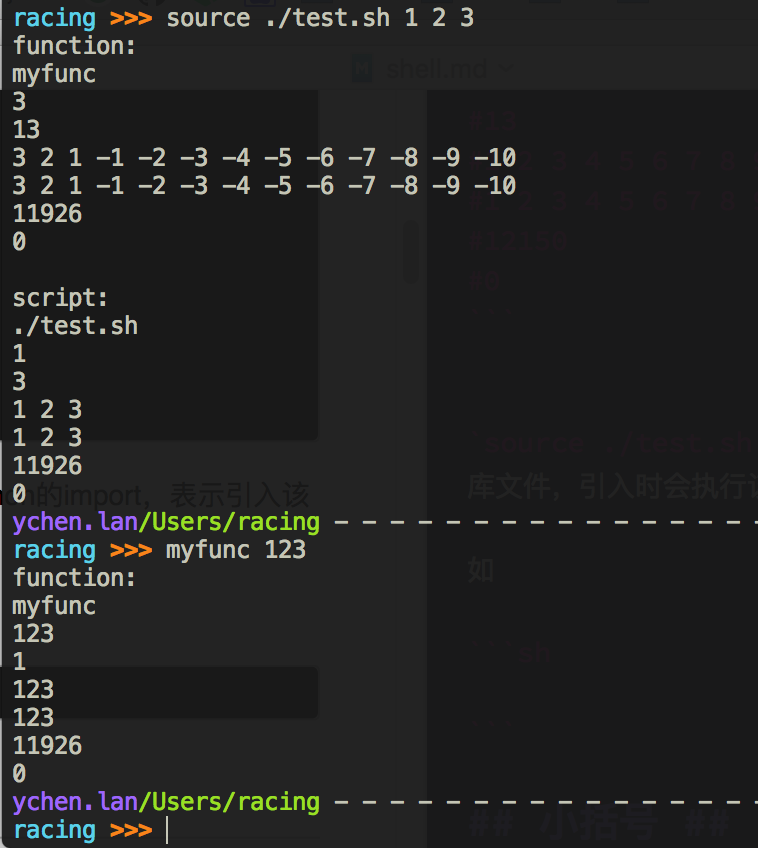
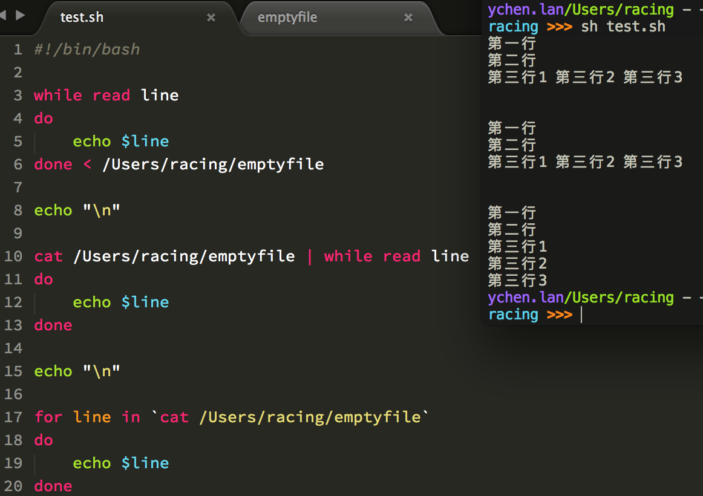

# shell script编程 #
在阅读此文档之前，强烈建议阅读[Shell脚本编程30分钟入门](https://github.com/qinjx/30min_guides/blob/master/shell.md)！

## 说明：##
- \$# 是传给脚本或函数的参数个数。
- 获取字符串的长度：\${#字符串}。数组应该使用\${#数组名[@或\*]}来获取长度。即\${a[@]}、\${a[\*]}可以用来获取数据全部内容。
- \$0 是脚本本身的名字，不管在函数内部还是外部使用。
- \$1 是传递给该脚本或函数的第一个参数。
- \$@ 是传给脚本或函数的所有参数的列表。
- \$\* 是以一个单字符串显示所有向脚本或函数传递的参数。
- \$\$ 是脚本运行的当前进程ID号，不管在函数内部还是外部使用。
- \$? 是显示上一个命令的退出状态，0表示没有错误，其他表示有错误，退出状态的取值范围是0到255。

如

```sh
#!/bin/bash
# test.sh
# sh test.sh 1 2 3 4 5 6 7 8 9 10 11 12 13
function myfunc() {
    echo "function:"
    echo $0
    echo $1
    echo $#
    echo $@
    echo $*
    echo $$
    echo $?
}

myfunc 3 2 1 -1 -2 -3 -4 -5 -6 -7 -8 -9

echo
echo "script:"
echo $0
echo $1
echo $#
echo $@
echo $*
echo $$
echo $?
##############output##################
#function:
#test.sh
#3
#12
#3 2 1 -1 -2 -3 -4 -5 -6 -7 -8 -9
#3 2 1 -1 -2 -3 -4 -5 -6 -7 -8 -9
#12150
#0
#
#script:
#test.sh
#1
#13
#1 2 3 4 5 6 7 8 9 10 11 12 13
#1 2 3 4 5 6 7 8 9 10 11 12 13
#12150
#0
```


`source ./test.sh`和`. ./test.sh`类似于python的import，表示引入该库文件，引入时会执行该库文件。引入之后，当前环境就可以使用库文件中的函数了。推荐使用点操作符来引入库文件。

如  


## 小括号 ##
### 单小括号() ###
1. **命令组**  
  括号中包含一组命令，如
  
  ```sh
  #!/bin/bash

  str="hello world"
  str2=${str}
  (cd Downloads;touch subshell.sh) #命令之间用分号隔开，命令和括号之间不需要空格
  echo ${str2}
  ```
  第5行括号中的命令会开一个子shell顺序执行：进入Downloads目录，创建subshell.sh文件。 
2. **命令替换**  
   等同于\`cmd\`，shell扫描一遍命令行，发现了\$(cmd)结构，便将\$(cmd)中的cmd执行一次，得到其标准输出，再将此输出放到原来命令。有些shell不支持，如tcsh。  
   如
   
    ```sh
    #!/bin/bash
    
    #echo输出默认会换行
    #echo中-e表示开启转义，开启转义后\c表示不换行
    for i in $(seq 0 4);do echo -e $i "\c";done
    echo
    #output:0 1 2 3 4
    for i in `seq 0 4`;do echo -e $i "\c";done
    echo
    #output:0 1 2 3 4
    ```
    
    ```sh
    #!/bin/bash

    #echo中-n表示不换行
    for i in $(seq 0 4);do echo -n "$i ";done
    echo
    #output:0 1 2 3 4
    for i in `seq 0 4`;do echo -n "$i ";done
    echo
    #output:0 1 2 3 4
    ```

3. **初始化数组**  
  如
  
  ```sh
  #!/bin/bash

  array=("str0" "str1" "str2" "str3")
  echo ${array[2]} # output: str2
  ```

### 双小括号(()) ###
1. **整数扩展**  
  这种扩展计算是整数型的计算，不支持浮点型。((exp))结构扩展并计算exp表达式的值，
  - 如果表达式的结果为0，那么返回“假”值，**返回的退出状态码为1**。
  - 如果表达式的结果为非0，那么返回“真”值，**返回的退出状态码为0**。
  - 若是逻辑判断，表达式值为真则为退出状态码1，假则为0。  
  
  如
  
  ```sh
  #!/bin/bash

  if ((3-2))
  then
      echo "yes"
  else
      echo "no"
  fi
  
  #运行输出yes
  ```
  
  ```sh
  #!/bin/bash

  if ((1 < 2))
  then
      echo "yes"
  else
      echo "no"
  fi
  
  #运行输出yes
  ```

2. **c语言规则**  
  只要括号中的运算符、表达式符合**C语言**运算规则，都可用在\$((exp))中，甚至是三目运算符。  
  
  如
  
  ```sh
  #!/bin/bash

  for ((i=0;i<12;i++))
  do
      echo -e "${i} \c" #echo默认原样输出后面的内容，-e表示开启\转义，\c表示不换行
  done
  #output:0 1 2 3 4 5 6 7 8 9 10 11
  ```

3. **重定义变量值**  
  也就是如果双小括号内是一个表达式时，双小括号会计算该表达式的值。该用法也可以用于重定义变量值。
  
  如
  
  ```sh
  #!/bin/bash

  a=5
  ((a++))
  echo ${a} #output:6

  ((a=7))
  echo ${a} #output:7
  ```


## 中括号 ##
### 单中括号[] ###
1. **比较表达式或者作为文件测试**  
  [是bash内部命令，[和test是等同的。如果我们不用绝对路径指明，通常我们用的都是bash自带的命令。if/test结构中的左中括号是调用test的命令标识，右中括号是关闭条件判断的。这个命令把它的参数作为比较表达式或者作为文件测试，并且根据比较的结果来返回一个退出状态码。if/test结构中并非必须带右中括号，但是新版的Bash中要求必须这样。
  
  如
  
  ```sh
  racing >>> which [
  [: shell built-in command
  ```
  
  ```sh
  #!/bin/bash

  if [ -e /Users/racing/test.pl ]
  then
      echo "file exists!"
  fi
  # output:file exists!
  
  if test -e /Users/racing/test.pl
  then
      echo "file exists!"
  fi
  # output:file exists!
  ```

2. **字符串比较**  
  test和[]中可用的比较运算符只有==或=和!=，两者都是用于字符串比较的，不可用于整数比较，整数比较只能使用-eq，-gt这种形式。无论是字符串比较还是整数比较都不支持大于号小于号。如果实在想用，对于字符串比较可以使用转义形式，如果比较"ab"和"bc"：[ ab \\< bc ]，结果为真，也就是返回状态为0。[]中的逻辑与和逻辑或使用-a 和-o 表示。
  
3. **数组引用**  
  如
  
  ```sh
  #!/bin/bash

  array=("str0" "str1" "str2" "str3")
  echo ${array[2]} # output: str2
  ```

### 双中括号[[]] ###
1. [[是bash的关键字，不是命令。[[]]比[]更通用，在[[]]内的所有字符都不会发生文件名扩展或者单词分割，但是会发生参数扩展和命令替换。
2. [[]]中能够防止一些容易犯的错误，[[]]中能够使用&&、||、<和>。而在[]中只能使用-a、-o、-lt和-gt。
3. **字符串模式匹配**  
  - 使用=~进行模式匹配，=~后的模式不要使用引号，如果=~后使用了引号，则表示=~后面只是纯字符串，而不是要匹配的模式。=~后面是**正则表达式**。**注意**：<font color="red">=~只把前面的字符串与后面的模式从开始位置往后匹配，当后面的模式匹配完毕并且全部匹配上时，则=~表达式的值为真（类似于Java的str.matches()）</font>。如果想要让=~前后完全匹配上，在=~后的模式中需要使用\$来进行结尾匹配。  
      如
  
        ```sh
        #!/bin/bash
        
        if [[ "test124" =~ ^t.+[0-9]+$ ]]
        then
          echo "matched!"
        fi
        #output:matched!
        ```
          
        ```sh
        #!/bin/bash
        
        if [[ "tes124" =~ test? ]]
        then
          echo "matched!"
        fi
        #output:matched!
        ```
  - 使用==进行模式匹配时，后面的模式不应使用双引号，使用了双引号的话，后面的就是纯字符串而不是模式。==后的模式是**glob**（与正则表达式不同）。==进行模式匹配时，只有当==前的字符串和==后的模式完全匹配上，结果才为真，而不像=~那样只匹配字符串的前面部分。  
      如
      
        ```sh
        #!/bin/bash
        
        if [[ "tes124" == tes12? ]] #==使用glob进行模式匹配
        then
            echo "matched1!"
        fi
        #output:matched1!
        
        if [[ "tes124" == tes1? ]] #==需要前后完全匹配上
        then
            echo "matched2!"
        fi
        #no output
    ```


## 大括号 ##
1. **大括号拓展**  
  使用glob模式，对大括号中的文件名做扩展。在大括号中，不允许有空白，除非这个空白被引用或转义。
  - 第一种：对大括号中的以逗号分割的文件列表进行拓展。如 touch {a,b}.txt 结果为a.txt b.txt。
  - 第二种：对大括号中以点点（..）分割的顺序文件列表起拓展作用，如：touch {a..d}.txt 结果为a.txt b.txt c.txt d.txt  
  
  如
  
  ```sh
  # ls {ex1,ex2}.sh    
  ex1.sh  ex2.sh    
  # ls {ex{1..3},ex4}.sh    
  ex1.sh  ex2.sh  ex3.sh  ex4.sh    
  # ls {ex[1-3],ex4}.sh #这里很好的说明了使用了glob模式  
  ex1.sh  ex2.sh  ex3.sh  ex4.sh  
  ```

2. **代码块**  
  又被称为内部组，这个结构事实上创建了一个匿名函数。与小括号中的命令不同，大括号内的命令不会新开一个子shell运行，即脚本余下部分仍可使用括号内变量。括号内的命令间用分号隔开，最后一个也必须有分号。{}的第一个命令和左括号之间必须要有一个空格。
  
  单大括号，{ cmd1;cmd2;cmd3;} 在当前shell顺序执行命令cmd1,cmd2,cmd3, 各命令之间用分号隔开, 最后一个命令后必须有分号, 第一条命令和左括号之间必须用空格隔开。
对{}和()而言, 括号中的重定向符只影响该条命令， 而括号外的重定向符影响到括号中的所有命令。

3. **获取变量值**  
  如
  
  ```sh
  #!/bin/bash
    
  str="hello world"
  str2=${str}
  echo ${str2}
  #output:hello world
  ```

4. **字符串模式匹配**  
  1. \${var:-string}、\${var:+string}、\${var:=string}、\${var:?string}
      - \${var:-string}中，若变量var为空，则用在命令行中用string来替换\${var:-string}，否则变量var不为空时，则用变量var的值来替换\${var:-string}；对于\${var:=string}的替换规则和\${var:-string}是一样的，所不同之处是\${var:=string}若var为空时，用string替换\${var:=string}的同时，把string赋给变量var： \${var:=string}很常用的一种用法是，判断某个变量是否赋值，没有的话则给它赋上一个默认值。
      - \${var:+string}的替换规则和上面的相反，即只有当var不是空的时候才替换成string，若var为空时则不替换或者说是替换成变量 var的值，即空值。(因为变量var此时为空，所以这两种说法是等价的) 。
      - \${var:?string}替换规则为：若变量var不为空，则用变量var的值来替换\${var:?string}；若变量var为空，则把string输出到标准错误中，并从脚本中退出。我们可利用此特性来检查是否设置了变量的值。
      
      补充扩展：这几种替换结构中string不一定是字符串常量，可用另外一个变量的值或是一种命令的输出。
  2. \${var%pattern}、\${var%%pattern}、\${var#pattern}、\${var##pattern}
      - ${var%pattern}，这种模式时，shell在var中查找pattern，看variable尾部是否与给出的pattern匹配，如果是，就把var的内容去掉右边最短的匹配模式当成返回值，var值没变。
      - ${var%%pattern}，这种模式时，shell在var中查找pattern，看variable尾部是否与给出的pattern匹配，如果是，就把var的内容去掉右边最长的匹配模式当成返回值，var值没变。
      - ${var#pattern}，这种模式时，shell在var中查找pattern，看variable首部是否与给出的pattern匹配，如果是，就把var的内容去掉左边最短的匹配模式当成返回值，var值没变。
      - ${var##pattern}，这种模式时，shell在var中查找pattern，看variable首部是否与给出的pattern匹配，如果是，就把var的内容去掉左边最长的匹配模式当成返回值，var值没变。

      模式匹配记忆方法：
        
      - \# 是去掉左边(在键盘上\#在\$之左边)
      - % 是去掉右边(在键盘上%在\$之右边)  
      
      单一\#和%符号是最小匹配，双\#和%符号是最大匹配。

        ```sh
        # var=testcase    
        # echo $var    
        testcase    
        # echo ${var%s*e}   
        testca    
        # echo $var    
        testcase   
        # echo ${var%%s*e}   
        te  
        # echo ${var#?e}    
        stcase  
        # echo ${var##?e}    
        stcase  
        # echo ${var##*e}    
          
        # echo ${var##*s}    
        e    
        # echo ${var##test}    
        case  
        ```
        
  3. \${var:num}、\${var:num1:num2}、\${var/pattern/pattern}、\${var//pattern/pattern}
      - \${var:num}，这种模式时，shell在var中提取第num个字符到末尾的所有字符。若num为正数，从左边0处开始；若num为负数，从右边开始提取字串，但必须使用在冒号后面加空格或一个数字或整个num加上括号，如\${var: -2}、\${var:1-3}或\${var:(-2)}。
      - \${var:num1:num2}，num1是位置，num2是长度。表示从\$var字符串的第\$num1个位置开始提取长度为\$num2的子串。不能为负数。
      - \${var/pattern/pattern}表示将var字符串的第一个匹配的pattern替换为另一个pattern。
      - \${var//pattern/pattern}表示将var字符串中的所有能匹配的pattern替换为另一个pattern。
      
      如
      
      ```sh
      racing >>> var=/Users/racing
      racing >>> echo $var
      /Users/racing
      racing >>> echo ${var:6}
      /racing
      racing >>> echo ${var: -6}
      racing
      racing >>> echo ${var:(-6)}
      racing
      racing >>> echo ${var:1:5}
      Users
      racing >>> echo ${var/U/u}
      /users/racing
      racing >>> echo ${var//s/S}
      /USerS/racing
      ```


## 数组 ##
使用小括号定义，各元素使用空格分隔。

### 获取数组长度和数组全部内容 ###
```sh
#!/bin/bash
# test.sh

a=(1 2 3 4 5)
echo ${a}  # 使用sh test.sh运行时，只输出了1，不应被用来获取数组全部内容
echo ${a[*]}  # 获取数组全部内容，推荐使用，此处输出1 2 3 4 5
echo ${#a}  # 使用sh test.sh运行时，输出1，不应被用来获取数组长度
echo ${#a[*]}  # 获取数组长度，推荐使用，此处输出5
```

### 获取元素内容、插入和删除元素 ###
```sh
#!/bin/bash

a=(1 2 3 4 5)
a[1]=100
a[10]=11  # 下标不存在时，自动插入该元素，此处是插入到下标为10的位置
unset a[3]
echo ${a[*]}  #output:1 100 3 5 11
echo ${#a[*]} #output:5
echo ${a[4]}  #output:5，下标为3的位置处的元素为空，没有该元素，下标为4的位置处的元素才是5
echo ${a[10]}  #output:11，下标为10的位置处的元素才是11
```

### 分片 ###
数组分片和使用字符串匹配的原理一样，见上文`大括号`中的`字符串模式匹配`。

```sh
#!/bin/bash

a=(1 2 3 4 5)
echo ${a[@]:1:2}  # output:2 3，“1”那个位置不能为负数
echo ${a[@]: -3}  # output:3 4 5
echo ${a[@]:(-3)}  # output:3 4 5

str="12345"
echo ${str:1:2}  # output:23，“1”那个位置不能为负数
echo ${str: -3}  # output:345
echo ${str:(-3)}  # output:345
```


## 函数 ##
函数需要在使用前就定义。直接使用函数名来调用函数，调用时不需要括号。

### 使用`$?`获取函数返回值（不推荐） ###
```sh
#!/bin/bash
function myfun {
  read -p "Enter a value:" value
  echo "double the value"
  return $[ $value * 2 ]
}

myfun

echo "The new vlue is $?"
#注：$?获取最近已执行命令的退出状态，退出状态的取值范围是0到255。
```

### 使用`echo`输出命令获取函数返回值（推荐） ###
```sh
#!/bin/bash
function addem {
  if [ $# -eq 0 ]||[ $# -gt 2 ]  # 此处$#获得函数参数个数
  then
    echo -1
  elif [ $# -eq 1 ]
  then
    echo $[ $1 + $1 ]
  else
    echo $[ $1 + $2 ]
  fi
}

if [ $# -eq 2 ]  # 此处$#获得脚本参数个数
then
  value=`addem $1 $2`
  echo "The value is $value"
else
  echo "Usage:test1 a b"
fi
```

### 局部变量 ###
在函数内默认定义和使用的变量是全局变量，函数内默认定义的变量在函数外部也可以使用。如果想定义局部变量，应该使用`local`关键字。

```sh
#!/bin/bash
function myfun {
  local value=$[ $value * 2 ]  # 左边的value是局部变量，右边的是全局变量
  echo $value  # 此处的value是局部变量
}
read -p "Enter a value:" value
result=`myfun`
echo "The new value is:$value"
echo "The result of the fun is $result"
```

### 递归 ###
```sh
#!/bin/bash

function factorial {
  if [ $1 -eq 1 ]
  then
    echo 1
  else
    local temp=$[ $1 -1 ]
    local result=`factorial $temp`
    echo $[ $result * $1 ]
  fi
}

read -p "Enter value:" value
result=`factorial $value`
echo "The factorial of $value is:$result"
```

## 标准输入输出和读文件 ##
### 使用read ###
1. `read var`从标准输入读取值到var。
2. `read -p "Please enter you name:" name`输出提示文字再读取。
3. `read -p "Enter your password:" -s password`在终端不显示出输入的字符，适用于密码输入。
4. `read -p "You have 2 seconds for entering:" -t 2 var`\-t表示输入等待时间为2秒，2秒未输入会退出。
5. `read -p "Enter into an array" -a array`\-a表示把内容读入到数组array中去，输入的数组元素默认是空格分隔的。
6. `read -p "reveive 5 chars" -n 5 str`\-n 5表示只接收5个字符给str，输入5个字符后就会结束该命令，不用等到按回车。
7. `read -d ":" str`\-d ":"表示以:结束输入行。输入时遇到:就会结束该命令，不用等到按回车。

#### 读文件 ####
```sh
#!/bin/bash

while read line
do
    echo $line
done < /Users/racing/test.py  # 推荐使用
```

```sh
#!/bin/bash
 
cat /Users/racing/test.py | while read line
do
    echo $line
done
```

```sh
#!/bin/bash
 
for line in `cat /Users/racing/test.py`  # 使用for读取时把空白符当做行结束符了
do
    echo $line
done
```

如（while正确处理了行结束符，没有正确处理其他空白符；for没有正确处理行结束符）



### 使用echo ###
1. `echo var`直接输出var。
2. `echo ${var}`输出var变量的值。
3. `echo -e ${var}`输出var时解释转义符。
4. `echo -n ${var}`输出var变量值后不换行。

## 整数运算 ##
### let和expr ###
```sh
#!/bin/bash

a=1
a=`expr ${a}+1`
let "a++"
echo ${a}  # output:3
```

# Reference #
1. [shell中各种括号的作用()、(())、\[\]、\[\[\]\]、{}](http://blog.csdn.net/taiyang1987912/article/details/39551385)
2. [linux shell 数组建立及使用技巧](http://www.cnblogs.com/chengmo/archive/2010/09/30/1839632.html)
3. [Linux\&shell之高级Shell脚本编程-创建函数](http://www.cnblogs.com/jiqing9006/p/3253232.html)