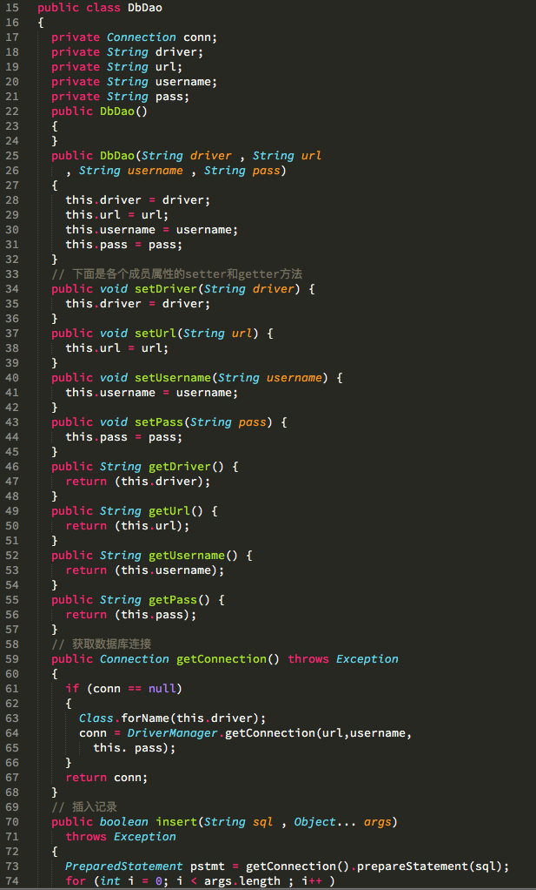
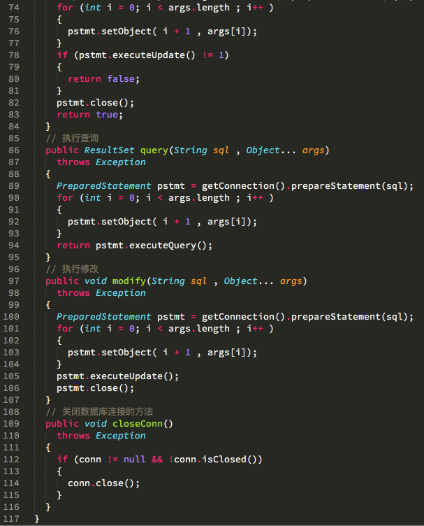
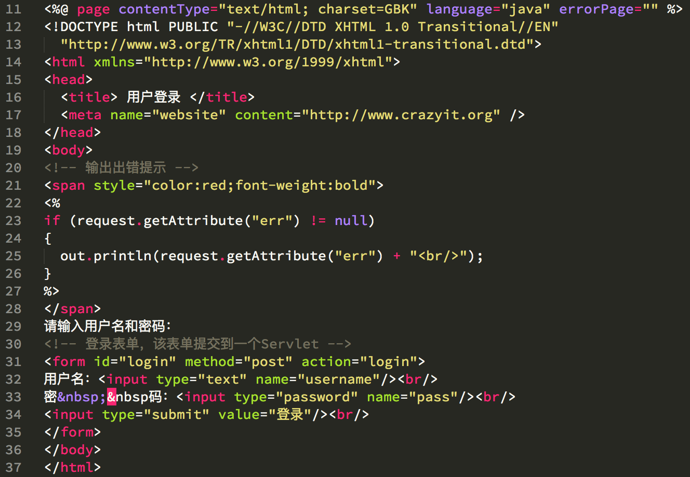
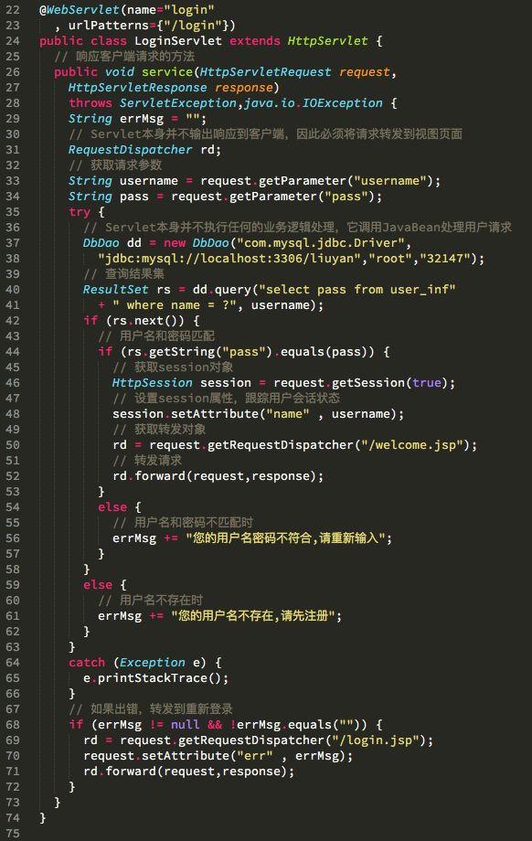
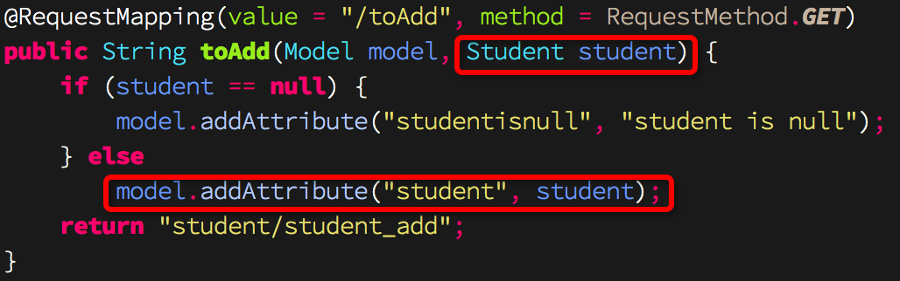

##HTTP是无状态的，B/S模式下，怎么保存客户端服务端状态？##
- 使用cookie，但是有大小限制，一般cookie只用来传递sessionId。
- 使用session，通过cookie传递sessionId，可以从服务器session中获取状态信息。但是禁用cookie怎么办？URL重写。
- URL重写，针对禁用cookie的情况，不能通过cookie传递sessionId，使用URL重写把sessionId重写到URL中去，从而可以从服务端获取到对应的session。比cookie更不安全，因为URL可能保存起来或者发送给别人。
- form表单添加token隐藏域，隐藏域值为sessionId，或者通过隐藏表单提交数据。

##Servlet、Servlet应用、Servlet容器：##
- 一个Servlet就是一个运行在服务器端的Java程序，一个Servlet应用包含了一个或多个Servlet，一个JSP页面会被翻译并编译成一个Servlet，一个Servlet容器中包含一个或多个Servlet应用。
- Servlet和JSP仅仅是Java企业版众多技术之一，其他的技术包括JMS、EJB、JSF、JPA等。典型的Servlet容器有Tomcat、Jetty、GlassFish、JBoss、Oracle Weblogic、IBM WebSphere等，一个Servlet应用对应到Tomcat或其他容器中的一个网站。Tomcat、Jetty不是Java企业版容器，不能运行EJB或JMS等。
- Tomcat配置应用程序，有显式配置和隐式配置，

    - 显式配置，

        - 在conf/server.xml中定义Context标签，该标签中必须使用docBase和path属性。
        - 在conf/Catalina/目录中新建xml文件，该xml文件名字即path的值，即应用名称。该xml文件中docBase属性是必须的，指明应用程序的位置。
    - 隐式配置，

        - 把war文件或整个应用程序复制到webapps目录中。

##容器Servlet、JSP、JavaBean的MVC：##

- Servlet仅作为控制器使用，仅充当控制器角色，它的作用类似于调度员：所有用户请求都发送给Servlet，Servlet调用Model来处理用户请求，并调用JSP来呈现处理结果；或者Servlet直接调用JSP将应用的状态数据呈现给用户。Model通常由JavaBean来充当，所有业务逻辑、数据访问逻辑都在Model中实现。实际上隐藏在Model下的可能还有很多丰富的组件，例如DAO组件、领域对象等。如，
  
  - M： 
    
  
  - V:
  
  - C:
  

##控制反转和依赖注入：##
- 控制反转是指在spring注册java bean，或者使用注解向spring注册。然后在合适的地方，就不要自己使用new来创建刚刚注册的java类的对象，而是spring会帮我们创建。
- 依赖注入有几种情形：

    - 一个类A中维持了另一个类B的引用，B已经使用控制反转的某种注册方法向spring中注册了自己。然后，在类A的某个方法运行时，需要用到B的某个方法，因为我们没有new B来创建B的对象，所以，spring会在我们使用B的时候，把B的实例注入到A类中的B的引用。
    - 在spring的controller的方法中，如果方法参数中使用到了某个对象比如HttpSession或者HttpRequest或者自己定义的类等，称作为依赖这个对象，那么在运行这个方法时，spring会把我们依赖的类的实例注入到这个方法参数的引用中。如，
        
      此处方法依赖student的实例，在运行时，spring会注入一个new Student()实例到student引用中去。输出为`null:null:null`，表示student不为null但是里面的属性都为null。

##Filter##
Servlet中的过滤器，是一个特殊的Servlet，类似于Spring中的aop/拦截器。

Filter作用：拦截所有请求和响应，添加特殊处理。

Servlet中编写Filter的两种方式：

- 实现Filter接口，web.xml中配置\<filter>和\<filter-mapping>。
- 实现Filter接口，使用@WebFilter注解。

##Listener##
监听Web内部事件，如Web应用被启动、停止，用户session开始、结束，用户请求到达等。

几个Listener接口：

1. `ServletContextListener`：用于监听Web应用的启动和关闭。
2. `ServletContextAttributeListener`：用于监听ServletContext范围（application）内属性的改变。
3. `ServletRequestListener`：用于监听用户请求。
4. `ServletRequestAttributeListener`：用于监听ServletRequest范围（request）内属性的改变。
5. `HttpSessionListener`：用于监听用户session的开始和结束。
6. `HttpSessionAttributeListener`：用于监听HttpSession范围（session）内属性的改变。

Servlet中编写Listener的两种方式：

- 实现Listener接口，web.xml中配置\<listener>。
- 实现Listener接口，使用@WebListener注解。

```java
import javax.servlet.ServletContext;
import javax.servlet.ServletContextEvent;
import javax.servlet.ServletContextListener;
import javax.servlet.annotation.WebListener;

@WebListener
public class GetconnListener implements ServletContextListener {

    // Web应用启动时，该方法被调用
    @Override
    public void contextInitialized(ServletContextEvent sce) {
        // 取得该应用的ServletContext实例
        ServletContext application = sce.getServletContext();
        // 从配置参数中获取驱动
        String driver = application.getInitParameter("driver");
    }

    // Web应用关闭时，该方法被调用
    @Override
    public void contextDestroyed(ServletContextEvent sce) {
    }

}
```

##Servlet3.0##
###模块化开发###
一个Web模块的目录：  

```
<webModule>.jar
|
|---META-INF
|     |
|      ---web-fragment.xml
|
|--Web模块所用的类文件、资源文件等
```

其中web-fragment.xml中可以定义`<name>`和`<ordering><before><after>`标签。`<name>`表示该模块的名字，`<ordering>`表示该模块和其他模块放在Web项目的WEB-INF/lib中时的加载顺序。

###异步处理###
Servlet3.0规范引入异步处理，允许Servlet重新发起一条新县城去调用耗时的业务方法，这样就可以避免等待。

异步处理是通过AsyncContext类来处理的，Servlet可通过**ServletRequest**的两个方法开启异步调用、创建AsyncContext对象。

- AsyncContext startAsync()
- AsyncContext startAsync(ServletRequest, ServletResponse)

```java
import javax.servlet.*;
import javax.servlet.http.*;
import javax.servlet.annotation.*;

import java.io.*;
import java.util.*;

@WebServlet(urlPatterns="/async", asyncSupported=true)
public class AsyncServlet extends HttpServlet
{
	@Override
	public void doGet(HttpServletRequest request
		, HttpServletResponse response)throws IOException,ServletException
	{
		response.setContentType("text/html;charset=GBK");
		PrintWriter out = response.getWriter();
		out.println("<title>异步调用示例</title>");
		out.println("进入Servlet的时间："
			+ new java.util.Date() + ".<br/>");
		// 创建AsyncContext，开始异步调用
		AsyncContext actx = request.startAsync();
		// 设置异步调用的超时时长
		actx.setTimeout(60 * 1000);
		// 启动异步调用的线程，该线程以异步方式执行
		actx.start(new GetBooksTarget(actx));
		out.println("结束Servlet的时间："
			+ new java.util.Date() + ".<br/>");
		out.flush();
	}
}
```

```java
import javax.servlet.*;
import javax.servlet.http.*;
import javax.servlet.annotation.*;

import java.io.*;
import java.util.*;

public class GetBooksTarget implements Runnable
{
	private AsyncContext actx = null;
	public GetBooksTarget(AsyncContext actx)
	{
		this.actx = actx;
	}
	public void run()
	{
		try
		{
			// 等待5秒钟，以模拟业务方法的执行
			Thread.sleep(5 * 1000);
			ServletRequest request = actx.getRequest();
			List<String> books = new ArrayList<String>();
			books.add("疯狂Java讲义");
			books.add("轻量级Java EE企业应用实战");
			books.add("疯狂Ajax讲义");
			request.setAttribute("books" , books);
			actx.dispatch("/async.jsp");
		}
		catch(Exception e)
		{
			e.printStackTrace();
		}
	}
}
```

被异步请求dispatch的目标页面需要制定session="false"，表明该页面不会重新创建session。

```java
<%@ page contentType="text/html; charset=GBK" language="java"
	session="false"%>
<%@ taglib prefix="c" uri="http://java.sun.com/jsp/jstl/core" %>
<ul>
<c:forEach items="${books}" var="book">
	<li>${book}</li>
</c:forEach>
</ul>
<%out.println("业务调用结束的时间：" + new java.util.Date());
if (request.isAsyncStarted()) {
	// 完成异步调用
	request.getAsyncContext().complete();
}%>
```

可以看到@WebServlet中设置了asyncSupported=true，也可以在web.xml中设置\<async-supported>true\</async-supported>来开启异步调用支持。

可以使用实现AsyncListener接口来监听异步调用的执行过程，只需要在startAsync()之后，在AsyncContext对象上使用addListener()添加AsyncListener对象实现即可。

###改进的Servlet API###
- HttpServletRequest增加了对文件上传的支持。
- ServletContext允许通过编程的方式动态注册Servlet、Filter。

HttpServletRequest提供了如下两个方法来处理文件上传：

- Part getPart(String name)：根据名称来获取文件上传域。
- Collection<Part> getParts()：获取所有的文件上传域。

```java
import javax.servlet.*;
import javax.servlet.http.*;
import javax.servlet.annotation.*;

import java.io.*;
import java.util.*;

@WebServlet(name="upload" , urlPatterns={"/upload"})
@MultipartConfig
public class UploadServlet extends HttpServlet
{
	public void service(HttpServletRequest request ,
		HttpServletResponse response)
		throws IOException , ServletException
	{
		response.setContentType("text/html;charset=GBK");
		PrintWriter out = response.getWriter();
		request.setCharacterEncoding("GBK");
		// 获取普通请求参数
		String name = request.getParameter("name");
		out.println("普通的name参数为：" + name + "<br/>");
		// 获取文件上传域
		Part part = request.getPart("file");
		// 获取上传文件的文件类型
		out.println("上传文件的的类型为："
			+ part.getContentType() + "<br/>");
		//获取上传文件的大小。
		out.println("上传文件的的大小为：" + part.getSize()  + "<br/>");
		// 获取该文件上传域的Header Name
		Collection<String> headerNames = part.getHeaderNames();
		// 遍历文件上传域的Header Name、Value
		for (String headerName : headerNames)
		{
			out.println(headerName + "--->"
				+ part.getHeader(headerName) + "<br/>");
		}
		// 获取包含原始文件名的字符串
		String fileNameInfo = part.getHeader("content-disposition");
		// 提取上传文件的原始文件名
		String fileName = fileNameInfo.substring(
			fileNameInfo.indexOf("filename=\"") + 10 , fileNameInfo.length() - 1);
		// 将上传的文件写入服务器
		part.write(getServletContext().getRealPath("/uploadFiles")
			+ "/" + fileName );
	}
}
```

##Servlet3.1##
###非阻塞式IO###
1. 调用ServletRequest的startAsync()方法来开启异步模式（获取AsyncContext对象）。
2. 通过ServletRequest获取ServletInputStream，并为ServletInputStream设置监听器（ReadListener实现类）。
3. 实现ReadListener接口来实现监听器，在该监听器的方法中以非阻塞方式读取数据。


##Tomcat 8的WebSocket##
@ServerEndPoint修饰java类。  
其中，还可以用@OnOpen、@OnClose、@OnMessage、@OnError修饰ServerEndPoint方法。